# FitbitApp — tu «WHOOP» gratis para la Google Fitbit Air, en tu iPhone

Especificación completa de requisitos para construir una **app personal para iPhone** que ofrezca con la **Google Fitbit Air** la experiencia de la app de **WHOOP** —cada mañana tu **Sueño**, tu **Recuperación** y tu **Carga** objetivo, con monitor de estrés y de salud, diario de hábitos, tendencias, informes, **análisis del día** y un **Coach IA con Claude o Gemini**— y que además **fusione las carreras de tu Apple Watch**, **sin pagar Google Health Premium ni ninguna cuota nueva** y con un diseño muy superior al de la app oficial.

> Estado: **v0.1 — código completo y compilando en macOS** (app, *widgets*, Live Activity, lógica con 121 pruebas y CI) sobre los requisitos verificados a 28/09/2026. Incluye también «Mi panel», plan semanal, registro de fuerza, respiración guiada, alarma inteligente con AlarmKit, Live Activity de entrenamiento, VO₂ máx. sin ejercicio (HUNT) y el resumen matinal e informe semanal redactados por la IA. Pendiente: instalarla con TestFlight y hacer el *spike* con tus datos reales.
> Decisiones tomadas: uso **solo personal**, **solo iPhone**, **sin cuotas nuevas**, **estética como prioridad**, **sin Mac** (compilación en GitHub Actions), **TestFlight** (Apple Developer Program), **Coach IA con Claude o Gemini** y **Apple Watch para correr** con sus datos fusionados.

## Resumen en 10 puntos

1. **Los datos de la Fitbit Air salen de la Google Health API** (REST v4), llamada **directamente desde tu iPhone** con tu cuenta de Google (la antigua Fitbit Web API se apaga el **30/09/2026**); los del **Apple Watch**, de **Salud** en el propio iPhone. Se **fusionan sin contar nada dos veces**: el Watch manda en sus carreras (ruta, ritmo, FC) y la Fitbit en el resto del día y en la noche (doc. 16).
2. **No hace falta Google Health Premium**: la API da gratis los datos brutos de la pulsera (FC, HRV nocturna, FC en reposo, sueño por fases, SpO₂, respiración, temperatura, actividad y entrenamientos). Las puntuaciones de Google (*Readiness*, *Sleep Score*, *Cardio Load*) ni siquiera están en la API.
3. **Todas las puntuaciones se calculan en el iPhone** con algoritmos abiertos basados en literatura científica verificada: **Recuperación 0–100 %**, **Carga 0–21**, **Sueño** (necesidad, suficiencia, eficiencia, constancia, deuda, planificador) y **Estrés 0–3**.
4. **Sin servidor y sin coste mensual**: base de datos local cifrada por iOS, **las dos fuentes se sincronizan cada vez que abres la app** (y en segundo plano), notificaciones locales y botón **«Analizar mi día»** (sin IA o con el Coach).
5. **App nativa SwiftUI (iOS 26+)** con Liquid Glass, anillos animados, Swift Charts, *widgets* de inicio y de pantalla de bloqueo y Live Activities.
6. **Sin Mac**: el proyecto se genera con XcodeGen y **GitHub Actions** compila en macOS en la nube (Xcode 26), ejecuta los tests, adjunta **capturas de cada pantalla** a los PR para revisar el diseño y **sube la app a TestFlight**, desde donde la instalas en tu iPhone.
7. **Coach IA con Claude o Gemini** y **tu propia clave** (pago por uso): con una pregunta al día, ≈ 2,7 $/mes con Claude Opus 5.5 o ≈ 0,5–1 $/mes con Gemini. Con Gemini, **solo clave de nivel de pago** (en el gratuito Google puede usar y revisar tus datos).
8. **Para uso personal** apenas aplica normativa (RGPD, producto sanitario, tiendas); sí las **condiciones de la Google Health API** y del proveedor de IA, que se cumplen con poco esfuerzo.
9. Plan: **F0** preparación y tubería TestFlight (2 sem) → **F1** MVP con Hoy/Sueño/Recuperación/Carga (6) → **F2** paridad con WHOOP, Apple Watch, análisis del día y *widgets* (9) → **F3** hábitos, edad fisiológica y Coach (7).
10. **Coste nuevo obligatorio: 0 €/mes** (el Apple Developer Program ya lo tienes; ≈ 200 min/mes de compilación macOS gratis en GitHub).

## Documentos

| # | Documento | Contenido |
|---|---|---|
| 01 | [Visión y alcance](docs/01-vision-y-alcance.md) | Decisiones tomadas, objetivos, fases, supuestos y **decisiones abiertas** |
| 02 | [Paridad con WHOOP](docs/02-paridad-con-whoop.md) | Inventario de funciones de WHOOP y su equivalente con la Fitbit Air |
| 03 | [Dispositivo y fuentes de datos](docs/03-dispositivo-y-fuentes-de-datos.md) | Fitbit Air, app Google Health, canales y catálogo de datos, brechas |
| 04 | [Requisitos funcionales](docs/04-requisitos-funcionales.md) | RF por módulo con prioridad, fase y criterios de aceptación |
| 05 | [Algoritmos y métricas](docs/05-algoritmos-y-metricas.md) | Fórmulas y parámetros de todas las puntuaciones |
| 06 | [Coach IA](docs/06-coach-ia.md) | Coach opcional: requisitos, arquitectura sin servidor, seguridad y coste |
| 07 | [Requisitos no funcionales](docs/07-requisitos-no-funcionales.md) | Estética, rendimiento, fiabilidad, seguridad, privacidad, accesibilidad, coste |
| 08 | [Arquitectura técnica](docs/08-arquitectura-tecnica.md) | App *local-first* en SwiftUI, módulos, flujos, instalación en tu iPhone |
| 09 | [Modelo de datos](docs/09-modelo-de-datos.md) | Tablas SQLite locales, retención, exportación y copia |
| 10 | [Integración con la Google Health API](docs/10-integracion-google-health-api.md) | Alta, ámbitos, OAuth en iOS, lectura, sincronización, políticas |
| 11 | [UX, diseño y pantallas](docs/11-ux-y-pantallas.md) | Dirección de arte, pantallas, onboarding, notificaciones, sistema de diseño, *widgets* |
| 12 | [Privacidad, seguridad y legal](docs/12-privacidad-seguridad-y-legal.md) | Qué aplica a tu caso (§0) y referencia completa |
| 13 | [Pruebas y validación](docs/13-pruebas-y-validacion.md) | Pruebas y validación científica de las métricas y del Coach |
| 14 | [Plan de proyecto y riesgos](docs/14-plan-de-proyecto-y-riesgos.md) | Hitos, épicas, riesgos, indicadores |
| 15 | [Entorno y prerrequisitos](docs/15-entorno-y-prerrequisitos.md) | Cuentas, herramientas, configuración y lista de tareas de F0 |
| 16 | [Apple Watch y fusión de datos](docs/16-apple-watch-y-fusion-de-datos.md) | Carreras del Watch vía Salud, reglas para no duplicar nada, sincronización al abrir |
| — | [Glosario](docs/glosario.md) · [Referencias](docs/referencias.md) | Términos y bibliografía científica |

Plantilla de configuración: [`Config/Secrets.example.xcconfig`](Config/Secrets.example.xcconfig).

## Capturas

Generadas automáticamente en el simulador (iPhone, iOS 26) por el *workflow* **iOS** con los datos de demostración ([`scripts/screenshots.sh`](scripts/screenshots.sh)). Todas en [`docs/capturas`](docs/capturas).

| Hoy | Carrera (Watch + Fitbit) | Sueño | Tendencias |
|---|---|---|---|
| 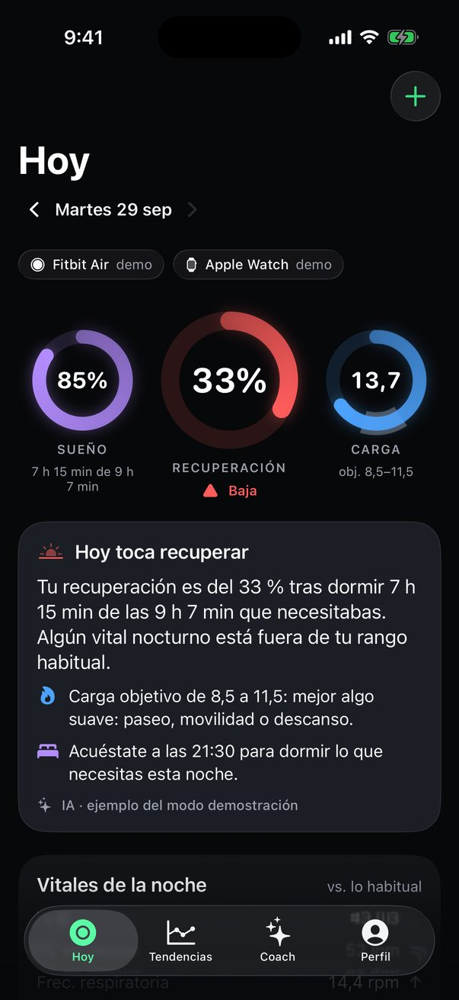 | 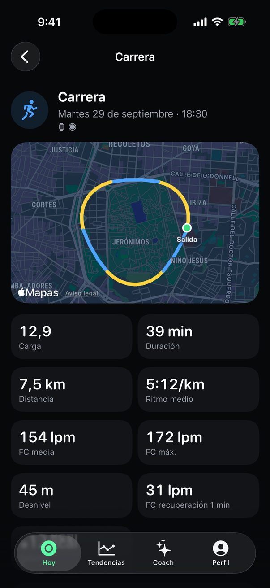 | 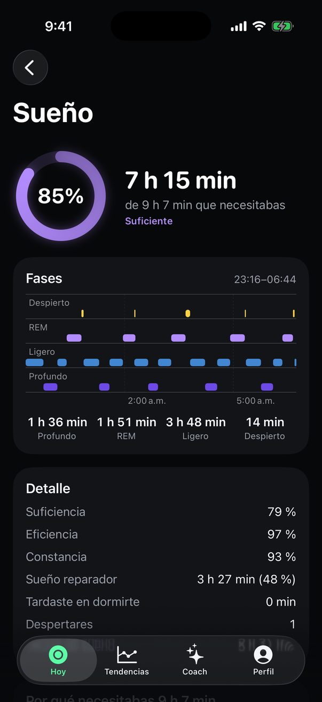 | 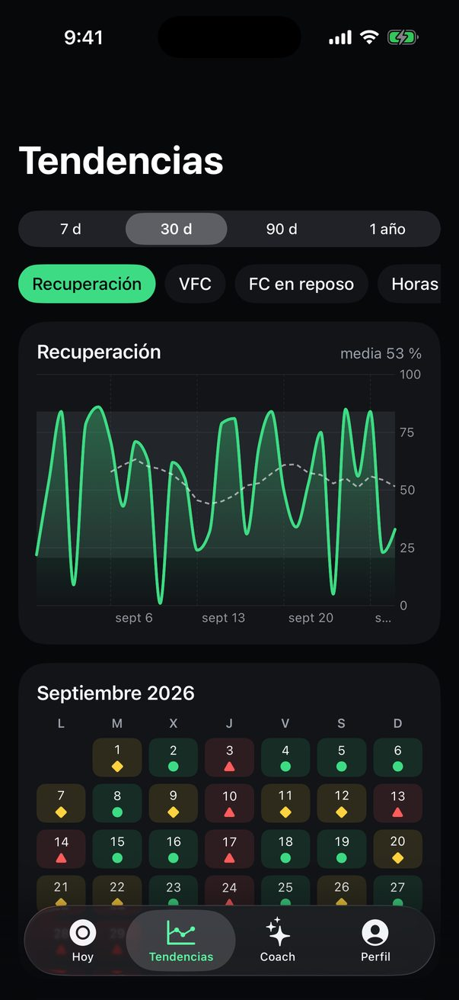 |
| **Análisis del día** | **Recuperación** | **Salud** | **Hoy (tema claro)** |
| 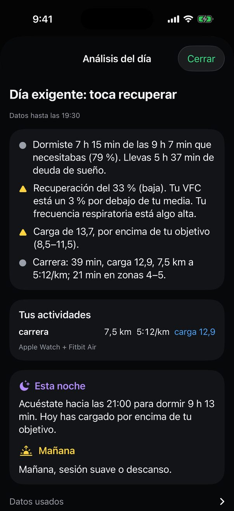 | 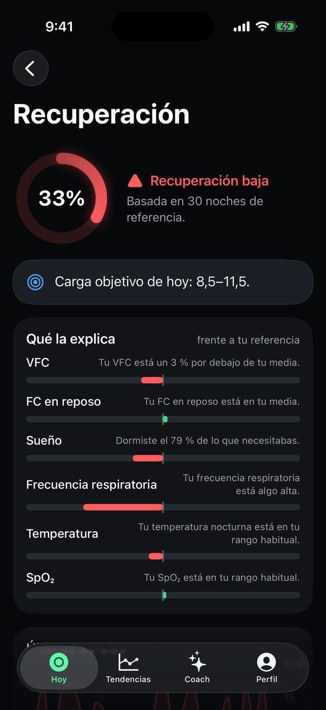 | 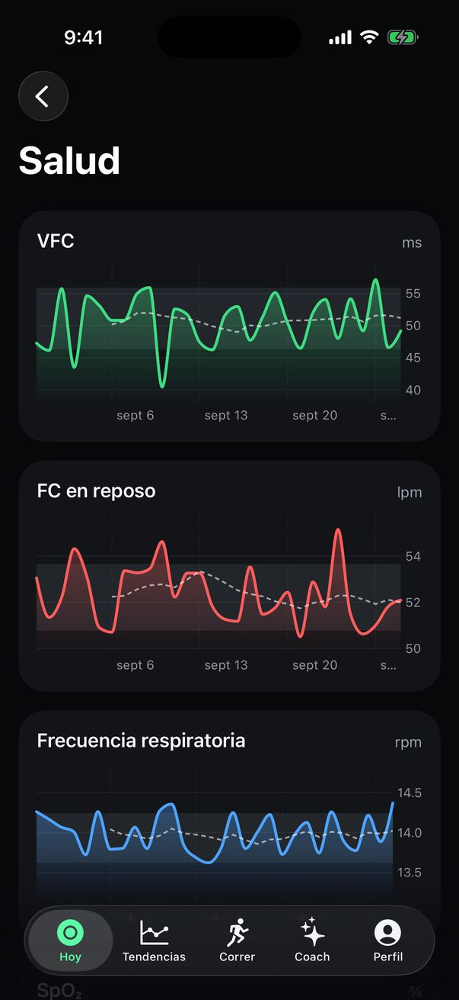 | 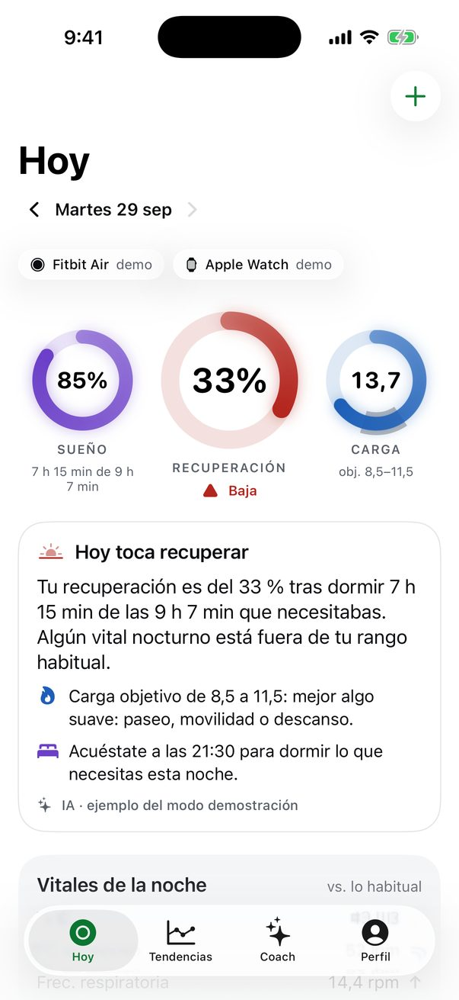 |
| **Mi panel** | **Plan semanal** | **Registro de fuerza** | **Entrenamiento en curso** |
| 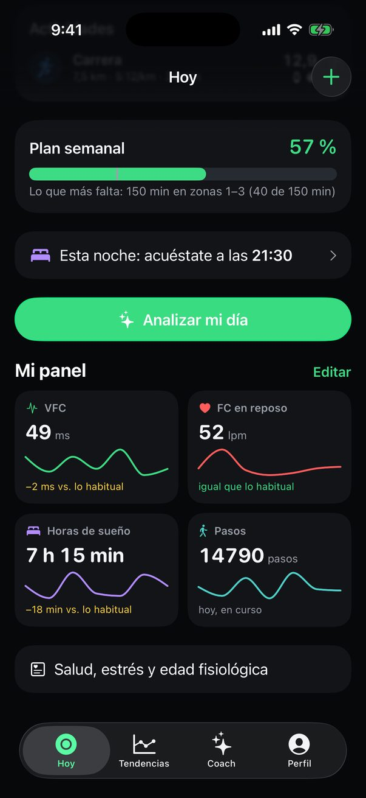 | 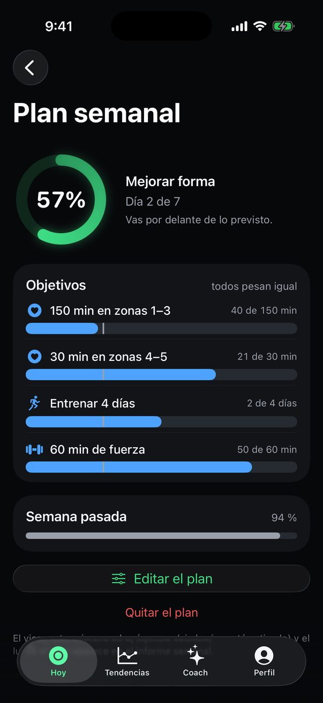 | 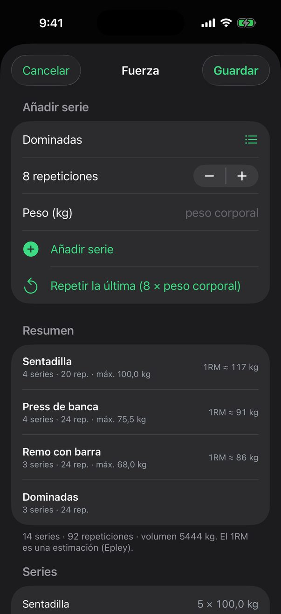 | 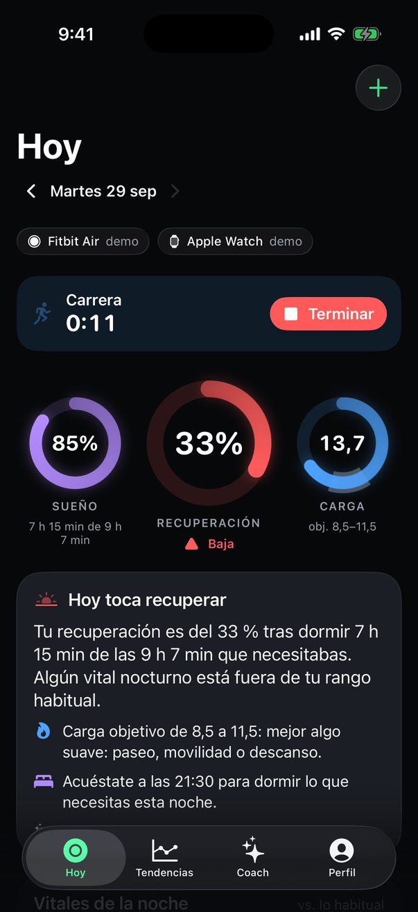 |
| **Respiración guiada** | **Alarma inteligente** | **VO₂ máx. y edad fisiológica** | **Informe semanal (IA)** |
| 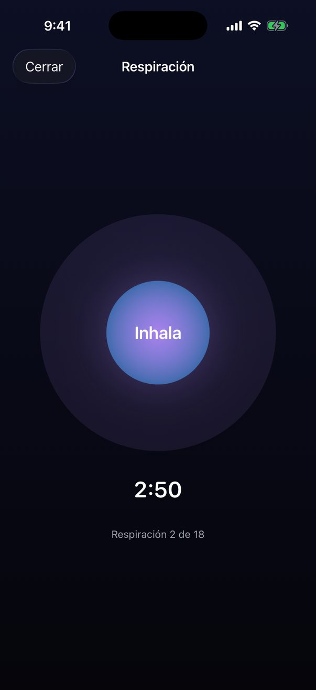 | 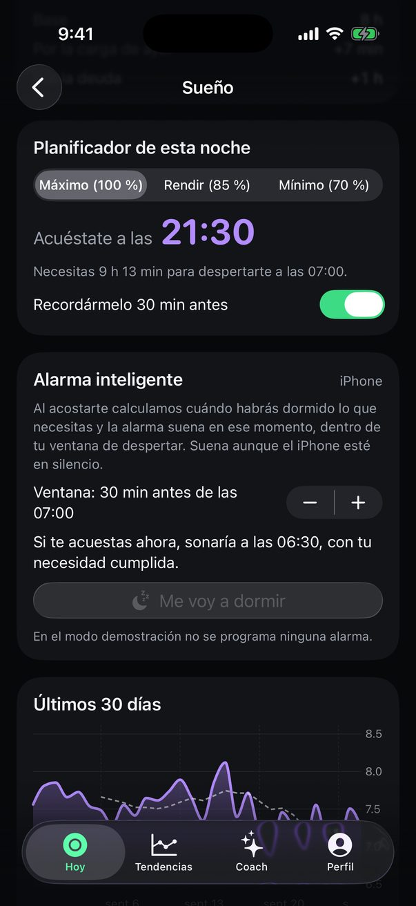 | 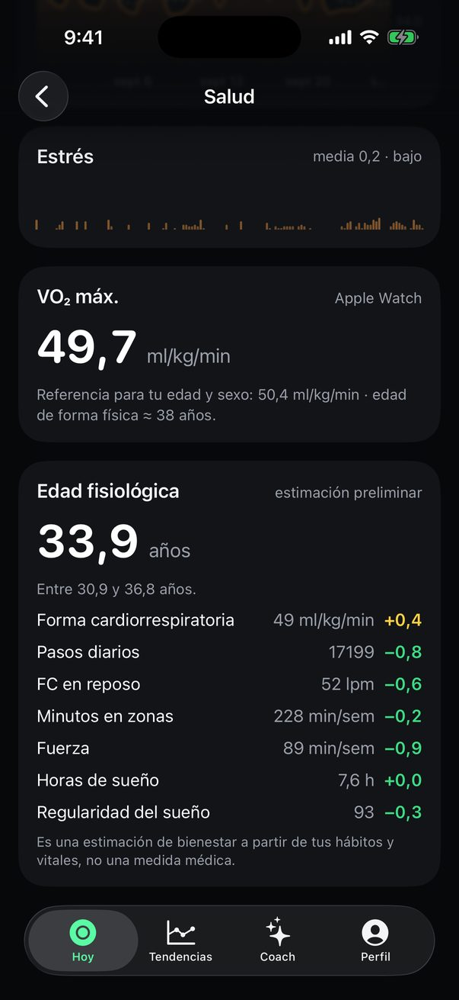 | 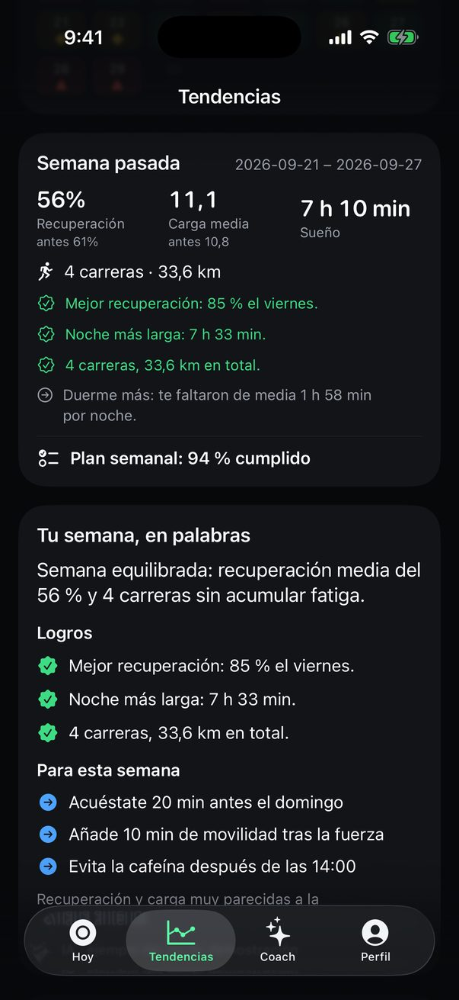 |

En el modo demostración, el resumen matinal y el informe semanal son **textos de ejemplo** (se indica en la tarjeta); con el Coach activado los redacta la IA con tus datos.

## Código

```
App/                      App SwiftUI (Hoy, detalles, tendencias, plan, fuerza, respiración, diario, Coach, perfil, onboarding)
                          y servicios del iPhone (HealthKit, OAuth, avisos, AlarmKit, Live Activity)
Widgets/                  Widgets de inicio y de pantalla de bloqueo, y la Live Activity de entrenamiento
Shared/                   Tipos compartidos entre la app y los widgets (atributos de la Live Activity)
Packages/RecuperaKit/     Toda la lógica, compilable y probada también en Linux:
  MetricsKit              algoritmos del doc. 05 y fusión Fitbit Air + Apple Watch (doc. 16)
  HealthAPI               cliente de la Google Health API v4 con OAuth PKCE
  Store                   base de datos local (SQLite con GRDB)
  SyncKit                 sincronización de las dos fuentes, avisos y widgets
  Insights                análisis del día, recomendaciones, informes, plan semanal, fuerza, «Mi panel» y respiración
  CoachKit                Coach IA con Claude o Gemini (herramientas, salvaguardas, costes e informes redactados)
project.yml               proyecto de Xcode generado con XcodeGen
.github/workflows/        ci-linux.yml (tests en cada push) · ios.yml (compilación iOS y TestFlight)
```

**Probar la lógica** (Linux o macOS con Swift 6): `cd Packages/RecuperaKit && swift test`.

**Compilar la app sin Mac** (GitHub Actions, macOS 26 con Xcode 26):

1. Guarda los secretos del [doc. 15 §4](docs/15-entorno-y-prerrequisitos.md#4-configuración-y-secretos) en *Settings › Secrets and variables › Actions*. Sin ellos la app compila igualmente con valores de ejemplo y funciona en **modo demostración**.
2. Lanza el *workflow* **iOS** a mano (*Actions › iOS › Run workflow*) o incluye `[macos]` en el mensaje de un commit. Los minutos de macOS cuentan ×10, por eso no se ejecuta en cada *push*.
3. Para instalarla, lanza el mismo *workflow* marcando **«Firmar y subir a TestFlight»** (necesita la clave de API de App Store Connect y el App ID con HealthKit y App Groups). La *build* aparece en la app TestFlight de tu iPhone.

**Compilar en un Mac** (si algún día tienes uno): `scripts/write-secrets-xcconfig.sh && xcodegen generate && open Recupera.xcodeproj`.

**Primer uso**: el onboarding pide tu perfil, conecta Google Health (Fitbit Air) y, si quieres, Apple Health (Apple Watch). También puedes pulsar «Probar con datos de demostración». El Coach está desactivado por defecto: actívalo en *Perfil › Coach IA* con tu clave de Claude o de Gemini (nivel de pago).

## Qué necesitas para empezar (F0)

1. Fitbit Air emparejada con la app **Google Health** y llevándola día y noche; iPhone con **iOS 26** o posterior y la app **TestFlight**; y, para correr, el **Apple Watch** grabando tus carreras (app Entreno).
2. En tu cuenta de **Apple Developer**: App ID (con HealthKit para el Apple Watch), ficha en App Store Connect, tú como probador interno y una clave de API para el CI.
3. **Tubería sin Mac** en GitHub Actions: un *merge* a `main` genera una *build* en TestFlight ([doc. 08 §6](docs/08-arquitectura-tecnica.md#6-compilación-pruebas-e-instalación-sin-mac-github-actions--testflight)).
4. Proyecto gratuito de **Google Cloud** con la Google Health API y un cliente OAuth de tipo iOS ([doc. 10 §2](docs/10-integracion-google-health-api.md#2-alta-del-proyecto-f0-gratis)), y una página de privacidad sencilla (GitHub Pages).
5. Hacer el ***spike* de datos** con tu cuenta (hito H0) antes de construir nada más.
6. Para F3: clave de **Claude** o de **Gemini** (esta, con facturación activada) con límite de gasto.

Lista completa en [docs/15-entorno-y-prerrequisitos.md](docs/15-entorno-y-prerrequisitos.md).

## Decisiones que aún debes confirmar

Ver [doc. 01 §8](docs/01-vision-y-alcance.md#8-decisiones-abiertas-para-el-propietario): nombre de la app, deportes principales, modo de la app en Google Cloud, qué hacer si se agotan los minutos gratuitos de compilación, el proveedor por defecto del Coach (lo decidirá la evaluación) y si adelantar el Apple Watch y el análisis del día a F1.

## Convenciones

- IDs trazables: `RF-*` (funcionales), `RNF-*` (no funcionales), `RL-*` (legales), `ALG-*` (algoritmos), `RSK-*` (riesgos), `OBJ-*`, `SUP-*`, `D-*`.
- Prioridad MoSCoW (M/S/C/W) y fase (F0–F3) en cada requisito.
- Cualquier cambio de requisitos se hace en estos documentos dentro de la misma PR que el código.
