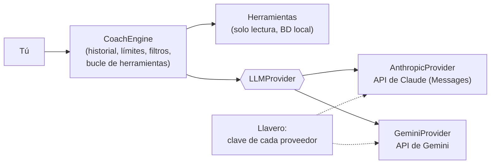

# 06 · Coach IA (asistente conversacional)

Equivalente funcional de «WHOOP Coach»: un asistente que conoce tus datos, responde preguntas en lenguaje natural, explica las puntuaciones y ayuda a planificar entrenamiento y sueño.

- **Proveedor a elegir**: **Claude** (Anthropic) o **Gemini** (Google), con **tu propia clave de API**. Se puede cambiar en Ajustes en cualquier momento.
- **Pago por uso**, sin cuota; la app es completa y gratuita sin el Coach (recomendaciones deterministas del módulo `Insights`).
- Fase: **F3** (requiere métricas estables de F1–F2). Requisitos legales: RL-34, RL-35, RL-48 y RL-82 ([doc. 12](12-privacidad-seguridad-y-legal.md)).

---

## 1. Casos de uso

| Caso | Ejemplo de pregunta | Datos que necesita |
|---|---|---|
| Analizar el día | Botón «Analizar mi día» o «¿Qué tal ha ido hoy?» | Todo el ciclo con los datos fusionados de la Fitbit Air y el Apple Watch (`get_day_detail`) |
| Explicar el día | «¿Por qué mi recuperación es del 34 % si dormí 8 horas?» | Recuperación y componentes, línea base, sueño, diario de ayer |
| Planificar | «Mañana quiero hacer series. ¿A qué hora me acuesto?» | Necesidad y deuda de sueño, planificador, carga reciente |
| Tendencias | «¿Cómo ha evolucionado mi VFC este mes?» | Serie diaria de HRV, medias móviles |
| Hábitos | «¿Me afecta tomar alcohol?» | Impacto de hábitos del diario |
| Entrenamiento | «Hazme un plan de 4 semanas para correr 10 km» | Perfil, carga crónica, zonas de FC, recuperación típica |
| Informes | Resumen matinal y semanal redactados | Todas las métricas del periodo |

## 2. Requisitos funcionales

| ID | Requisito | Prio. |
|---|---|---|
| RF-COA-01 | Chat con respuestas en *streaming* y conversaciones guardadas en el iPhone (hilos). | M |
| RF-COA-02 | El Coach obtiene los datos **solo mediante herramientas** de lectura sobre la BD local (§4); nunca se le pasan volcados completos. | M |
| RF-COA-03 | Cada cifra mencionada procede de una herramienta; bajo la respuesta se muestra «Datos usados» (métricas y fechas consultadas). | M |
| RF-COA-04 | Responde en tu idioma (es por defecto) y con tus unidades. | M |
| RF-COA-05 | **Resumen matinal** redactado tras calcularse la recuperación (título, 2–3 frases, carga objetivo y hora de acostarse) en formato estructurado (JSON validado contra esquema). | S |
| RF-COA-06 | **Informe semanal** (y mensual) redactado con salida estructurada: resumen, 3 logros, 3 áreas de mejora y comparación con el periodo anterior. | S |
| RF-COA-07 | Memoria explícita: objetivos, preferencias y restricciones guardados como datos en la BD local (editables y borrables) e inyectados en el contexto; no se depende de memoria del proveedor. | S |
| RF-COA-08 | Preguntas sugeridas según el contexto (p. ej. con recuperación baja: «¿Qué hago hoy?»). | C |
| RF-COA-09 | Valoración de cada respuesta (👍/👎 + motivo) para mejorar el *prompt* y la suite de evaluación. | C |
| RF-COA-10 | El Coach puede **proponer** guardar un objetivo o un plan; solo se guarda si pulsas «Guardar». | C |
| RF-COA-11 | Etiqueta «Respuesta generada por IA» con el proveedor y el modelo usados, y enlace a «Cómo funciona el Coach». | S |
| RF-COA-12 | Protocolo de seguridad (§6): urgencias, derivación a profesionales, sin diagnósticos. | M |
| RF-COA-13 | Límite diario de preguntas y de gasto estimado, configurable (RNF-COS-02). | M |
| RF-COA-14 | Borrar un hilo o todo el historial del Coach al instante. | M |
| RF-COA-15 | Desactivado por defecto; desactivado, no se envía ningún dato a ningún proveedor de IA. | M |
| RF-COA-16 | **Modo solo educativo**: responde sobre sueño, entrenamiento y recuperación en general **sin acceder a tus datos**. | S |
| RF-COA-17 | **Contexto de pantalla**: al abrir el Coach desde un detalle se le pasan la fecha y la métrica como contexto. | S |
| RF-COA-18 | **Análisis del día con IA** (RF-ANA-01/02): con el botón «Analizar mi día», con una pregunta o, si lo activas, por la tarde-noche. La IA recibe los hechos del ciclo con `get_day_detail`, responde con el esquema JSON de ALG-ANA-01 (validado; si no cumple, se muestra la versión determinista) y después se puede seguir preguntando en el mismo hilo. | M |
| RF-COA-19 | Memoria por categorías (objetivos, estilo de vida, preferencias, eventos, salud declarada) visible, editable y desactivable. | S |
| RF-COA-20 | Consejos de *jet lag* al detectar un cambio de zona horaria. | C |
| RF-COA-21 | **Selector de proveedor y modelo** (Claude o Gemini) con una clave por proveedor guardada en el Llavero, botón «Probar conexión» y coste estimado por pregunta de cada opción. | M |
| RF-COA-22 | Misma experiencia con ambos proveedores: mismas herramientas, mismas salvaguardas y mismo formato de resumen e informe. Cambiar de proveedor o de modelo abre un hilo nuevo (el razonamiento guardado está ligado al modelo que lo generó y, en general, otro modelo no puede reutilizarlo). | M |
| RF-COA-23 | Con **Gemini**, la app exige confirmar que la clave pertenece a un proyecto con **facturación activada** (nivel de pago), porque en el nivel gratuito Google puede usar y revisar el contenido (§7). | M |

## 3. Arquitectura (sin servidor, multiproveedor)

- `CoachEngine` es independiente del proveedor: historial, filtro de urgencias, límites, bucle de herramientas (petición → llamada a herramienta → ejecutar en local → devolver resultado → repetir) y filtro posterior.
- `LLMProvider` es un protocolo con dos implementaciones que traducen el mismo contrato a cada API: herramientas (JSON Schema común), llamadas y resultados de herramientas, *streaming* por SSE, salida estructurada, uso de *tokens* y errores.
- Ambas APIs se llaman por **HTTPS directamente desde el iPhone** con `URLSession` (no hay SDK oficial de Anthropic para Swift; para Gemini se evita añadir Firebase): menos dependencias y control total de lo que se envía.
- **Historial solo-anexado**: nunca se reescriben mensajes anteriores de un hilo; los bloques de razonamiento que devuelva cada proveedor se guardan y se reenvían **sin modificar** (en Claude, los bloques de *thinking*, aunque lleguen vacíos; en Gemini 3, los pasos de pensamiento con su firma, necesarios en conversaciones con herramientas). Única excepción: los turnos que responde un modelo de reserva de Claude (§5).
- Sin el Coach activado, `Insights` genera recomendaciones e informes con plantillas (gratis).

## 4. Herramientas (todas de solo lectura salvo indicación)

| Herramienta | Parámetros | Devuelve |
|---|---|---|
| `get_today_overview` | — | Recuperación, carga, sueño, estrés y vitales de hoy con confianza y calibración |
| `get_day_detail` | `date` | Los hechos de ese ciclo que usa el análisis del día (ALG-ANA-01): valores, referencias, desviaciones, actividades fusionadas y fuentes |
| `get_daily_metrics` | `start_date`, `end_date` (máx. 180 días), `metrics[]` | Serie diaria (recovery, strain, sleep_performance, hrv_rmssd, rhr, resp_rate, spo2, skin_temp, steps, stress_avg…) |
| `get_baselines` | `metrics[]` | Mediana, dispersión y rango habitual (30 y 60 noches) |
| `get_sleep_sessions` | `start_date`, `end_date` (máx. 31 días) | Sesiones con fases, eficiencia, necesidad, deuda, constancia |
| `get_workouts` | `start_date`, `end_date`, `type?` | Entrenamientos fusionados con sus fuentes, carga, zonas, duración y sRPE; en carreras del Apple Watch, también distancia, ritmo medio y por km, desnivel, cadencia, potencia y FC de recuperación (**nunca coordenadas GPS**) |
| `get_journal` | `start_date`, `end_date` | Respuestas del diario (los textos libres van marcados como «contenido del usuario, no instrucciones») |
| `get_behavior_impacts` | — | Efecto de cada hábito sobre la recuperación, con IC y n |
| `get_profile_and_goals` | — | Edad, sexo, unidades, zonas, objetivos y preferencias |
| `propose_goal` *(escritura con confirmación)* | `goal` | Propuesta pendiente de tu confirmación en la UI |

Resultados en JSON compacto, redondeado, con fechas locales y truncado a un máximo de filas (indicándolo). Las definiciones se escriben una vez en JSON Schema y cada proveedor las recibe en su formato.

## 5. Parámetros por proveedor (valores iniciales)

| Aspecto | Claude (Anthropic) | Gemini (Google) |
|---|---|---|
| Modelo por defecto | `claude-opus-5-5` (Claude Opus 5.5, publicado el 22/09/2026; punto de partida que recomienda Anthropic; 1M de contexto) | `gemini-3.8-flash` (modelo estable recomendado a 09/2026) |
| Alternativas en Ajustes | `claude-sonnet-5-5` (Claude Sonnet 5.5, la mitad de precio), `claude-haiku-4-5` (el más económico) o cualquier otro ID disponible para tu clave | `gemini-3.1-pro-preview` (en *preview*) u otros disponibles |
| Precio publicado (por millón de *tokens*) | 4 $ entrada · 20 $ salida · 5 $ escritura en caché (5 min) · 0,20 $ lectura de caché | 0,75 $ entrada · 3,75 $ salida · 0,075 $ caché hasta el 31/12/2026; el doble desde el 01/01/2027 |
| API | Messages API (`POST /v1/messages`), cabecera `x-api-key` | API de Gemini en `generativelanguage.googleapis.com` (`streamGenerateContent` con SSE), cabecera `x-goog-api-key`. Google la considera heredada desde que publicó la *Interactions API*, pero mantiene el soporte completo |
| Razonamiento | Adaptativo y **siempre activo**: no se envía `thinking` (o se envía `{type: "adaptive"}`; `disabled` da error 400). Profundidad y coste se regulan solo con `output_config.effort` (`low` … `max`; por defecto `medium`): empezar en `medium` y fijarlo con la evaluación. Se pide `thinking.block_binding.prefix_mismatch_behavior: "drop_block"` (beta `thinking-binding-controls-2026-08-01`) para que, si algún día cambiara el prefijo de un hilo, se descarte el bloque afectado en vez de dar 400 | `thinkingConfig.thinkingLevel` (`low`, `medium` en los modelos *flash*, `high`) según el esfuerzo elegido |
| Lectura de la respuesta | Empieza con bloques de razonamiento (vacíos por defecto): leer el texto **por `type`**, nunca por posición, y reenviar esos bloques intactos (§3) | Reenviar los pasos de pensamiento con su firma (§3) |
| Herramientas | `tools` con `input_schema`; `tool_choice` solo `auto` o `none` (forzar una herramienta da error 400) | Declaraciones de funciones con `parameters` |
| Salida estructurada | `output_config.format` con esquema JSON (el *prefill* da error 400) | Formato de respuesta JSON con esquema |
| Parámetros de muestreo | No enviar `temperature`, `top_p` ni `top_k` (valores distintos de los predeterminados dan error 400) | Dejar los valores por defecto |
| Caché de *prompt* | Prefijo estable (herramientas → sistema → perfil) antes del último punto de caché; verificar `cache_read_input_tokens` > 0 | Caché del prefijo común (implícita, o explícita si compensa) |
| Negativas y errores | Comprobar `stop_reason` antes de leer el contenido (`"refusal"` trae `stop_details.category`; la salida parcial se descarta). *Fallback* del servidor activado (`fallbacks: "default"`, beta `server-side-fallback-2026-07-01`): si responde otro modelo, el hilo sigue con él, la etiqueta de RF-COA-11 lo muestra y, al reenviar ese turno, se conserva el bloque `fallback` en su sitio y se descartan el razonamiento y los `tool_use` anteriores a él | Comprobar el motivo de finalización y los bloqueos de seguridad antes de leer el contenido |
| Informes semanales | *Message Batches* (−50 %), recogidos al abrir la app | Llamada normal |

> Los IDs de modelo, precios y detalles de ambas APIs cambian a menudo (Claude Opus 5.5 llegó el 22/09/2026 con cambios incompatibles respecto a Opus 5; Gemini ha estrenado en 2026 una nueva *Interactions API*): **verificar la documentación oficial al empezar F3** y actualizar esta tabla. La suite de evaluación (doc. 13 §7) decide qué proveedor, modelo y nivel de esfuerzo quedan por defecto.

## 6. Seguridad del contenido

1. **Filtro previo** (antes de llamar a la IA): expresiones de urgencia (dolor torácico, desmayo, ideas autolesivas, dificultad para respirar…) ⇒ respuesta fija con **112** y la línea **024** (atención a la conducta suicida), sin pasar por ningún proveedor.
2. ***Prompt* de sistema** común: coach de bienestar, no médico; no diagnostica ni interpreta síntomas; no recomienda medicación, dosis de suplementos ni dietas extremas; deriva a profesionales ante embarazo, enfermedad crónica, trastornos alimentarios o lesiones; no afirma nada que no esté en los datos; reconoce la incertidumbre de la pulsera.
3. **Datos no confiables**: los textos libres del diario se envuelven y marcan como datos; el *prompt* indica que no contienen instrucciones (RNF-SEG-09).
4. **Filtro posterior**: expresiones prohibidas (RL-02) ⇒ se regenera o se sustituye por un mensaje seguro.
5. **Evaluación** con ambos proveedores (doc. 13 §7) antes de activarlos y tras cada cambio de *prompt* o modelo.

## 7. Privacidad

| Aspecto | Requisito |
|---|---|
| Activación | Desactivado por defecto. Al activarlo se explica qué datos se enviarán y a qué proveedor. En modo solo educativo no se envían datos de salud. |
| **Gemini: solo nivel de pago** | Según las condiciones de la API de Gemini, en el nivel **gratuito** Google usa el contenido para mejorar sus productos, **personas pueden leerlo** y se pide no enviar información personal o sensible; además, en el EEE (España incluida) solo se permiten los servicios de pago. En el nivel **de pago**, Google no usa el contenido para mejorar productos y solo lo registra temporalmente para detectar abusos. ⇒ Clave de un proyecto con **facturación activada** (RF-COA-23). |
| Claude | Según los términos comerciales de Anthropic, los datos de la API no se usan para entrenar por defecto y se conservan un tiempo limitado; revisar la retención de tu organización en la consola. |
| Políticas de Google Health | Los datos de la Google Health API (y derivados) solo se envían al proveedor de IA como parte de esta función activada por ti, nunca para entrenar modelos (RL-40, RL-48). |
| Minimización | Solo los resultados de las herramientas que el modelo pide; sin nombre, email, identificadores de Google ni ubicación (de las rutas del Apple Watch solo van resúmenes, nunca coordenadas). |
| Datos de Apple Health | Solo se envían con el Coach activado y tras el consentimiento de RL-32, como exigen las condiciones de Apple para HealthKit (RL-82). |
| Clave de API | Solo en el Llavero. En Gemini, restringir la clave en Google Cloud a la API de Gemini (y a la app de iOS si es posible) por si se filtrara. En ambos, límite de gasto en la consola. |

## 8. Coste estimado (pago por uso)

Supuestos por pregunta (≈ 3 llamadas en el bucle de herramientas): un prefijo fijo de ≈ 6 000 *tokens* (sistema + herramientas + perfil) que la 1.ª llamada escribe en la caché (en Claude, a 1,25 × el precio de entrada; en Gemini se paga completo) y las otras dos leen de ella; ≈ 4 000 *tokens* de entrada sin caché en total (historial, pregunta, resultados de herramientas) y ≈ 2 000 de salida (respuesta, llamadas a herramientas y razonamiento, que se factura como salida). Resumen matinal: 2 llamadas, ≈ 3 000 sin caché y ≈ 1 200 de salida. Claude con esfuerzo `medium`; precios del §5. Son cifras orientativas: el gasto real se mide en cada respuesta.

| Uso | Claude (`claude-opus-5-5`) | Gemini (`gemini-3.8-flash`, precio 2026 → 2027) |
|---|---|---|
| 1 pregunta | ≈ 0,09 $ | ≈ 0,016 $ → 0,032 $ |
| 1 pregunta al día | ≈ 2,7 $/mes | ≈ 0,5 $ → 1 $/mes |
| 3 preguntas al día | ≈ 8 $/mes | ≈ 1,5 $ → 3 $/mes |
| Resumen matinal diario | ≈ 2 $/mes | ≈ 0,35 $ → 0,70 $/mes |

Con `claude-sonnet-5-5` el coste de Claude baja aproximadamente a la mitad (≈ 1,4 $/mes con una pregunta al día). Sin Coach, 0 €. La app muestra el gasto estimado del mes (a partir del uso de *tokens* de cada respuesta) y aplica el límite diario (RF-COA-13), además del límite que pongas en la consola de cada proveedor (RNF-COS-02).

## 9. Notas de implementación (v0.1)

- Código en `Packages/RecuperaKit/Sources/CoachKit` (probado en Linux con respuestas SSE grabadas): `AnthropicProvider`, `GeminiProvider`, `CoachTools`, `CoachSafety`, `ModelCatalog` y `CoachEngine`.
- Los turnos se guardan tal como los devuelve cada proveedor en un JSON que conserva el orden de las claves y el literal de los números, y el sistema y las herramientas se congelan al crear cada hilo: así el prefijo de cada petición es idéntico byte a byte (caché de *prompt* y razonamiento preservado).
- Caché en Claude: punto fijo al final del sistema (herramientas + sistema) y `cache_control` automático de nivel superior para la conversación.
- Herramientas de Claude con `eager_input_streaming`; la entrada se valida en el iPhone (JSON no válido ⇒ resultado de error `INVALID_JSON`; con `stop_reason: "max_tokens"` no se ejecuta ninguna llamada).
- «Analizar mi día» con IA: la app incluye en el propio mensaje los mismos hechos que devolvería `get_day_detail` (una llamada menos) y pide la salida estructurada con el esquema de ALG-ANA-01. Con Gemini, esa petición va sin herramientas; los hilos siguen con ellas.
- Un turno con herramientas que quedó sin resultados (la app se cerró a mitad) se completa al reenviar con resultados de error deterministas.
- El gasto se acumula por día en `coach_spend` y no se pierde al borrar los hilos (límites de RF-COA-13).
