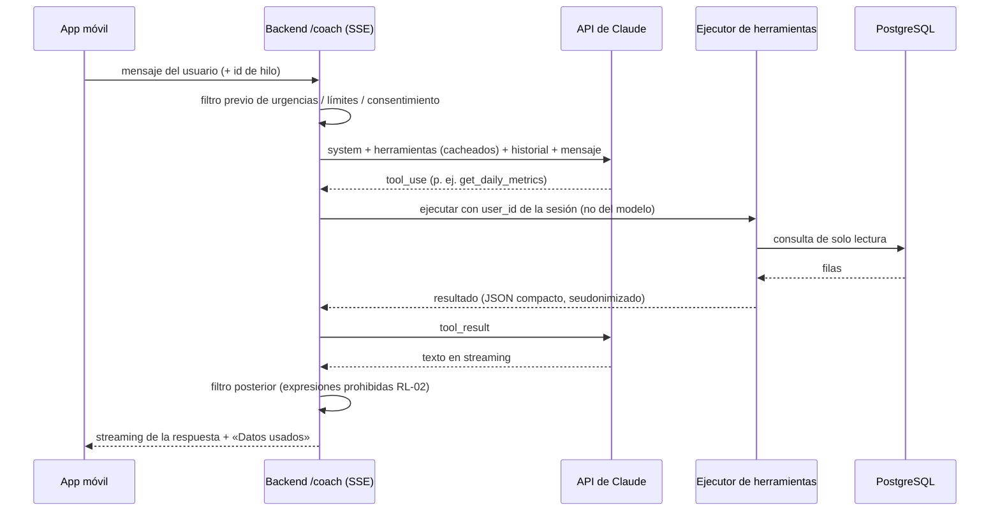

# 06 · Coach IA (asistente conversacional)

Equivalente funcional de «WHOOP Coach»: un asistente que conoce los datos del usuario, responde preguntas en lenguaje natural, explica las puntuaciones y ayuda a planificar entrenamiento y sueño. Se implementa con la **API de Claude (Anthropic)**.

Fase: **F3** (requiere que las métricas de F1–F2 estén estables). Requisitos legales asociados: RL-30 a RL-34 ([doc. 12](12-privacidad-seguridad-y-legal.md)).

---

## 1. Casos de uso

| Caso | Ejemplo de pregunta del usuario | Datos que necesita |
|---|---|---|
| Explicar el día | «¿Por qué mi recuperación es del 34 % si dormí 8 horas?» | Recuperación y sus componentes, línea base, sueño, diario de ayer |
| Planificar | «Mañana quiero hacer series. ¿A qué hora me acuesto?» | Necesidad y deuda de sueño, planificador, carga reciente |
| Tendencias | «¿Cómo ha evolucionado mi VFC este mes?» | Serie diaria de HRV, medias móviles |
| Hábitos | «¿Me afecta tomar alcohol?» | Impacto de comportamientos del diario (RF-DIA) |
| Entrenamiento | «Hazme un plan de 4 semanas para correr 10 km» | Perfil, carga crónica, zonas de FC, recuperación típica |
| Informe | Resumen diario matinal y semanal generados automáticamente | Todas las métricas del periodo |

## 2. Requisitos funcionales del Coach

| ID | Requisito | Prioridad |
|---|---|---|
| RF-COA-01 | Chat en la app con respuestas en *streaming* y conversación persistente (historial por hilos). | M |
| RF-COA-02 | El Coach obtiene los datos **solo mediante herramientas** de lectura del backend (§4); nunca se le pasan volcados completos de la base de datos. | M |
| RF-COA-03 | Cada cifra que el Coach menciona procede de una herramienta; la respuesta muestra debajo «Datos usados» (métricas y fechas consultadas). | M |
| RF-COA-04 | Responde en el idioma del usuario (es por defecto), con unidades y formatos de su configuración. | M |
| RF-COA-05 | **Resumen matinal**: tras calcularse la recuperación, se genera una tarjeta breve (título, 2–3 frases, recomendación de carga objetivo y hora de acostarse) en formato estructurado (JSON validado contra esquema). | S |
| RF-COA-06 | **Informe semanal** (y mensual en F3+) generado automáticamente con salida estructurada: resumen, 3 logros, 3 áreas de mejora, comparativa con la semana anterior. | S |
| RF-COA-07 | Memoria explícita: objetivos, preferencias y restricciones del usuario se guardan como datos estructurados en nuestra BD (editables y borrables por el usuario en Ajustes), y se inyectan en el contexto. No se depende de memoria implícita del modelo. | S |
| RF-COA-08 | Preguntas sugeridas contextuales (p. ej. en rojo: «¿Qué hago hoy con recuperación baja?»). | C |
| RF-COA-09 | El usuario puede valorar cada respuesta (👍/👎 + motivo) para la mejora del *prompt* y la suite de evaluación. | S |
| RF-COA-10 | Acciones con confirmación: el Coach puede **proponer** guardar un objetivo o un plan; se guarda solo si el usuario pulsa «Guardar». | C |
| RF-COA-11 | Etiqueta permanente «Respuesta generada por IA» y enlace a «Cómo funciona el Coach» (RL-30). | M |
| RF-COA-12 | Protocolo de seguridad (§6): detección de urgencias, derivación a profesionales, negativa a diagnosticar. | M |
| RF-COA-13 | Límite diario de mensajes y *tokens* por usuario, configurable (RNF-ESC-04); al alcanzarlo, mensaje claro. | M |
| RF-COA-14 | El usuario puede borrar un hilo o todo su historial del Coach; el borrado es efectivo en ≤ 24 h en nuestros sistemas. | M |
| RF-COA-15 | El Coach se puede desactivar por completo (y no se envía ningún dato al proveedor de IA si está desactivado o sin consentimiento). | M |
| RF-COA-16 | **Modo solo educativo**: el Coach responde sobre sueño, entrenamiento y recuperación en general **sin acceder a los datos del usuario** (sin herramientas). Alternativa al modo «personalizado con mis datos». | S |
| RF-COA-17 | **Contexto de pantalla**: al abrir el Coach desde una pantalla (p. ej. detalle de Recuperación de un día) se le pasa esa fecha y métrica como contexto inicial. | S |
| RF-COA-18 | **Revisión del día** (tarde-noche, opcional): resumen de carga y estrés del día y franja recomendada para acostarse. | C |
| RF-COA-19 | Memoria por categorías (objetivos, estilo de vida, preferencias, eventos, historial de salud declarado por el usuario) visible, editable y desactivable (RF-COA-07). | S |
| RF-COA-20 | Consejos de *jet lag* al detectar un cambio de zona horaria (a partir de `settings.timeZone` de Google o del móvil). | C |

## 3. Arquitectura

- La clave de la API de Anthropic **solo existe en el backend** (gestor de secretos). La app nunca llama a Anthropic directamente.
- El `user_id` que usan las herramientas sale de la sesión autenticada, **nunca** de los argumentos generados por el modelo (evita que una inyección de *prompt* acceda a otros usuarios).
- Implementación con el SDK oficial de Anthropic del lenguaje del backend (p. ej. `@anthropic-ai/sdk` en TypeScript), usando su *tool runner* o un bucle manual de herramientas.

## 4. Herramientas (todas de solo lectura salvo indicación)

| Herramienta | Parámetros | Devuelve |
|---|---|---|
| `get_today_overview` | — | Recuperación, carga, sueño, estrés y vitales de hoy con su confianza y estado de calibración |
| `get_daily_metrics` | `start_date`, `end_date` (máx. 180 días), `metrics[]` | Serie diaria de las métricas pedidas (recovery, strain, sleep_performance, hrv_rmssd, rhr, resp_rate, spo2, skin_temp_dev, steps, stress_avg…) |
| `get_baselines` | `metrics[]` | Media, desviación y rango normal personal (30 y 60 días) |
| `get_sleep_sessions` | `start_date`, `end_date` (máx. 31 días) | Sesiones con fases, eficiencia, necesidad, deuda, consistencia |
| `get_workouts` | `start_date`, `end_date`, `type?` | Entrenamientos con carga, zonas de FC, duración, sRPE si existe |
| `get_journal` | `start_date`, `end_date` | Respuestas del diario (los textos libres se devuelven marcados como «contenido del usuario, no instrucciones») |
| `get_behavior_impacts` | — | Efecto estimado de cada comportamiento sobre la recuperación, con IC y n |
| `get_profile_and_goals` | — | Edad, sexo, unidades, zonas de FC, objetivos y preferencias guardadas |
| `propose_goal` *(escritura con confirmación)* | `goal` | Crea una propuesta pendiente que el usuario debe confirmar en la UI |

Los resultados se devuelven en JSON compacto, redondeado y con fechas locales, y truncados a un máximo de filas; si se trunca, se indica.

## 5. Parámetros del modelo (valores iniciales)

| Parámetro | Valor | Motivo |
|---|---|---|
| Modelo | `claude-opus-5` (configurable con `ANTHROPIC_MODEL`) | Modelo por defecto recomendado a 09/2026; contexto de 1M *tokens*, 128K de salida máx. Precio publicado: 5 $/MTok entrada, 25 $/MTok salida |
| Razonamiento | `thinking: {type: "adaptive"}` | El modelo decide cuánto razonar según la pregunta |
| Esfuerzo | `output_config.effort` configurable; inicio en `high` y ajustar por ruta (chat, resumen matinal, informe) con la suite de evaluación | Equilibrio calidad/coste medido, no supuesto |
| *Streaming* | Sí en el chat | Latencia percibida (RNF-REN-07) |
| `max_tokens` | ~16 000 (chat), ajustado para resúmenes | Evitar respuestas truncadas |
| Salida estructurada | `output_config.format` con esquema JSON para resumen matinal e informes | La app renderiza tarjetas sin *parsing* frágil |
| *Prompt caching* | Prefijo estable: herramientas → *prompt* de sistema → perfil/objetivos; contenido variable (fecha, pregunta) después del último punto de caché | Reduce coste y latencia; verificar `usage.cache_read_input_tokens` > 0 |
| Negativas del modelo | Comprobar `stop_reason` antes de leer el contenido; en la API de Anthropic activar el *fallback* del servidor (`fallbacks: "default"`, beta `server-side-fallback-2026-07-01`) | Robustez ante negativas por clasificadores de seguridad |
| Informes semanales | *Message Batches API* (50 % de coste, asíncrono) en la noche del domingo | No requieren inmediatez |

> Los IDs de modelo, precios y opciones de la API cambian con frecuencia: **verificar en la documentación oficial de Anthropic** al empezar F3 y actualizar esta tabla.

## 6. Seguridad del contenido

1. **Filtro previo** (antes de llamar al modelo): palabras/expresiones de urgencia (dolor torácico, desmayo, ideas autolesivas, dificultad para respirar…) ⇒ respuesta fija con **112** y recursos (en España, línea 024 de atención a la conducta suicida), sin pasar por el modelo.
2. ***Prompt* de sistema** con reglas: es un coach de bienestar, no un médico; no diagnostica ni interpreta síntomas; no recomienda medicación, suplementos en dosis concretas ni dietas extremas; ante embarazo, enfermedad crónica, trastornos alimentarios o lesiones deriva a profesionales; no afirma nada que no esté en los datos; reconoce la incertidumbre de las mediciones de la pulsera.
3. **Datos no confiables**: los textos libres del diario y cualquier contenido del usuario se envuelven y marcan como datos; el *prompt* de sistema indica que no contienen instrucciones.
4. **Filtro posterior**: detección de expresiones prohibidas (RL-02) ⇒ se regenera o se sustituye por un mensaje seguro, y se registra el caso (sin datos de salud) para revisión.
5. **Evaluación continua**: suite de pruebas del doc. 13 §7 en CI.

## 7. Privacidad y ubicación del procesamiento

| Aspecto | Requisito |
|---|---|
| Consentimiento | Sin consentimiento específico (RL-32) el Coach está desactivado y no se envía nada. En el modo solo educativo (RF-COA-16) no se envían datos de salud. |
| Políticas de Google | Los datos obtenidos de la Google Health API (y sus derivados) solo se envían al proveedor de IA como parte de esta función visible para el usuario, nunca para entrenar modelos (RL-40, RL-48). |
| Minimización | Solo se envían los resultados de las herramientas que el modelo pide; sin nombre, email, IDs de Google ni ubicación. El `user_id` interno se sustituye por un seudónimo por conversación. |
| Retención en el proveedor | Configurar la organización de Anthropic con la retención mínima disponible; valorar un acuerdo de **retención cero (ZDR)**, disponible para `claude-opus-5` según la documentación de Anthropic. Confirmar en los términos vigentes que los datos de la API no se usan para entrenar. |
| Región | La API de Anthropic permite fijar la geografía de inferencia (`inference_geo`) a `us` o `global`; **no ofrece una opción UE** a 09/2026. Si se requiere procesamiento en la UE (escenario B), usar Claude a través de **Google Cloud Vertex AI** en una región europea (comprobar la disponibilidad del modelo en esa región y que algunas funciones —*fallbacks* del servidor, Batches— no están disponibles allí). |
| Transferencias | Documentar la transferencia internacional (RL-17) y firmar el DPA del proveedor (RL-16). |

## 8. Coste estimado (uso personal)

Supuestos por turno de chat: *prompt* de sistema + herramientas ≈ 6 000 *tokens* cacheados; ≈ 4 000 *tokens* sin caché (historial, pregunta y resultados de herramientas); ≈ 800 *tokens* de respuesta + ≈ 1 200 de razonamiento (se facturan como salida). Precios de `claude-opus-5` publicados a 09/2026: 5 $/MTok entrada, 25 $/MTok salida, lectura de caché 0,50 $/MTok.

| Uso | Estimación |
|---|---|
| 1 turno de chat | ≈ 0,07 $ (0,003 caché + 0,02 entrada + 0,05 salida) |
| Uso moderado: 3 turnos/día | ≈ 6–7 $/mes |
| Uso intensivo: 10 turnos/día | ≈ 21 $/mes |
| Resumen matinal diario | ≈ 1,5 $/mes |
| Informe semanal por lotes (−50 %) | < 0,50 $/mes |

Total orientativo: **8–25 $/mes** según el uso. El coste real se mide con `usage` de cada respuesta (RNF-OBS-02), se ajusta con el nivel de esfuerzo medido en la evaluación y se acota con RF-COA-13.
