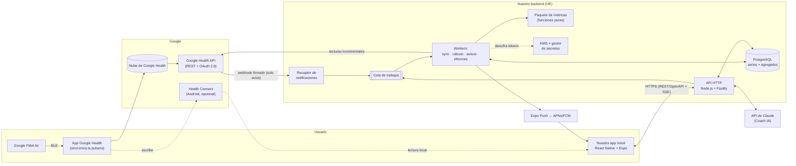
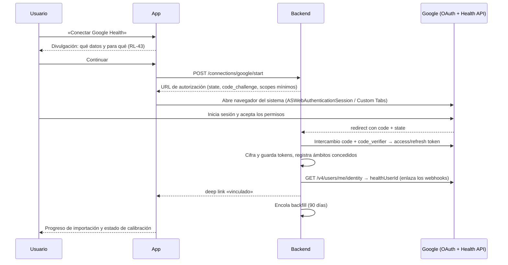

# 08 · Arquitectura técnica

## 1. Visión general



**Principio rector**: la pulsera sincroniza con la app oficial **Google Health**; nosotros leemos los datos de la nube de Google mediante la **Google Health API** (sucesora de la Fitbit Web API, que se retira en septiembre de 2026). No hay comunicación Bluetooth directa con la pulsera (RL-62).

## 2. Decisiones de arquitectura (resumen de ADR)

Cada decisión se documentará como ADR en `docs/adr/NNN-titulo.md` (RNF-MAN-06).

| ADR | Decisión | Alternativas consideradas | Motivo |
|---|---|---|---|
| 001 | **Fuente de datos principal: Google Health API v4** desde el backend | Fitbit Web API (se apaga el 30/09/2026; sin altas nuevas); Bluetooth directo (protocolo propietario, rompe términos); Health Connect como única fuente (solo Android, sin SpO₂); HealthKit (Google Health no escribe HRV ni temperatura) | Única vía oficial multiplataforma con todos los datos necesarios, histórico completo y *webhooks* |
| 002 | **Health Connect como fuente complementaria en Android** (F3) | Solo nube | Menor latencia (lee en el propio móvil lo que Google Health ya escribió) y resiliencia si la API falla |
| 003 | **App multiplataforma con React Native + Expo (TypeScript)** | Flutter; nativo Kotlin + Swift; Kotlin Multiplatform | Un solo código para iOS y Android, mismo lenguaje que el backend, builds en la nube (EAS) sin necesitar un Mac para cada compilación |
| 004 | **Backend en TypeScript (Node.js 24 LTS) con Fastify** y trabajos en cola | Python/FastAPI; Go | Tipos compartidos con la app (esquemas zod), ecosistema maduro; las métricas no requieren cálculo pesado |
| 005 | **Métricas como paquete puro y determinista** (`packages/metrics`), sin E/S | Cálculo en SQL o en la app | Testeable, reproducible (RNF-DIS-07), reutilizable en servidor y en el móvil |
| 006 | **PostgreSQL gestionado en la UE** con tablas particionadas por mes (o TimescaleDB) | NoSQL/series temporales dedicadas | Un único almacén relacional basta para la escala prevista (RNF-ESC-02) |
| 007 | **Google Cloud en `europe-southwest1` (Madrid)**: Cloud Run (API y workers), Cloud SQL, Cloud Tasks + Cloud Scheduler, Secret Manager, Cloud KMS | Supabase (UE), Fly.io, Hetzner | Ya se necesita un proyecto de Google Cloud para la API; escala a cero; región española |
| 008 | **Coach IA con la API de Claude** (`claude-opus-5`) desde el backend | Otros LLM; modelo local | Calidad en razonamiento sobre datos y uso de herramientas; opción de procesamiento UE vía Vertex AI (doc. 06 §7) |
| 009 | **Notificaciones con Expo Push** (APNs/FCM) | FCM/APNs directos | Menos configuración; se puede migrar |
| 010 | **API propia REST + OpenAPI** con cliente TypeScript generado; SSE para el Coach | tRPC; GraphQL | Contrato explícito y agnóstico del lenguaje |

## 3. Componentes

### 3.1 App móvil (`apps/mobile`)

- React Native + Expo (Router), TypeScript estricto.
- Estado de servidor con TanStack Query y caché persistente (SQLite) para funcionar sin conexión (RNF-DIS-02).
- Gráficos: librería nativa de alto rendimiento (p. ej. Victory Native/Skia) para cumplir RNF-REN-03.
- Almacenamiento seguro: `expo-secure-store` (Keychain/Keystore) para la sesión de nuestra app. **Nunca** tokens de Google.
- Autenticación del usuario en nuestra app: Sign in with Google (misma cuenta que la de Google Health, pero **consentimiento separado** para los datos de salud) y Sign in with Apple en iOS.
- Módulo nativo de Health Connect (Android, F3) con permisos solo de lectura.
- i18n (es/en), temas claro/oscuro, accesibilidad (RNF-ACC).

### 3.2 API (`apps/api`)

- Endpoints para la app: perfil, resumen de hoy, detalle por métrica y fecha, series para tendencias, diario, entrenamientos, ajustes, exportación, borrado, Coach (SSE).
- Flujo OAuth con Google: `/connections/google/start` (genera `state` + PKCE) y `/connections/google/callback` (intercambia el código, cifra y guarda los *tokens*, lanza el *backfill*).
- Receptor de *webhooks* de la Google Health API (`POST /webhooks/google-health`): responde al *handshake* de verificación, comprueba secreto y firma Tink (RNF-SEG-10), guarda el evento en `webhook_events`, encola y responde **204** de inmediato (doc. 10 §6.2).
- El suscriptor de *webhooks* se registra una vez por proyecto con una **cuenta de servicio** (rol *Google Health API Editor*) desde un script de despliegue, no desde la app.
- Validación de entrada/salida con zod; documentación OpenAPI generada.

### 3.3 Workers (`apps/worker`)

| Trabajo | Disparador | Qué hace |
|---|---|---|
| `backfill` | Tras vincular la cuenta | Descarga 90 días de historial (ampliable) por tipo de dato, primero las 30 últimas noches; FC con `rollUp` de 60 s en tramos de 14 días |
| `sync-incremental` | *Webhook* (intervalos notificados), apertura de la app, programador | Re-consulta los intervalos notificados o las últimas 48 h por tipo de dato (la API no ofrece *feed* de cambios) |
| `recompute-day` | Tras cada ingesta que toca una fecha | Recalcula ciclo, sueño, recuperación, carga, estrés de las fechas afectadas y líneas base posteriores |
| `morning-ready` | Cuando la recuperación del día pasa a «calculada» | Genera resumen matinal (F3) y envía la notificación |
| `bedtime-reminder` | Programado según planificador de sueño | Aviso para acostarse |
| `weekly-report` | Domingo por la noche (hora local) | Informe semanal (F2) + versión IA (F3) |
| `behavior-impact` | Semanal | Recalcula el impacto de comportamientos del diario |
| `token-health` | Diario | Detecta *tokens* revocados/caducados y avisa al usuario |
| `retention-purge` | Diario | Aplica RNF-PRI-03 |

Cola: Cloud Tasks (o `pg-boss` sobre PostgreSQL en local/alternativa sin Google Cloud). Todos los trabajos son idempotentes (RNF-DIS-03).

**Sondeo adaptativo** (red de seguridad y tipos sin *webhook*, como SpO₂ en muestras y VO₂ máx.): cada 15 min entre las 05:00 y las 11:00 hora local mientras no haya sueño de la noche, cada 6 h el resto del día, y al abrir la app (máx. 1/min por usuario). Antes de consultar, `pairedDevices.lastSyncTime` indica si la pulsera ha sincronizado algo nuevo. Limitador por usuario ≤ 4 peticiones/s (cuota de la API: 300/min por usuario).

### 3.4 Paquete de métricas (`packages/metrics`)

Funciones puras con entrada = datos normalizados + parámetros + versión y salida = puntuaciones + componentes + confianza. Especificación en [05-algoritmos-y-metricas.md](05-algoritmos-y-metricas.md). Sin dependencias de red ni de base de datos; se ejecuta en el worker y, opcionalmente, en la app (vista previa sin conexión).

### 3.5 Adaptador de fuentes de datos (`packages/google-health`)

Interfaz interna `HealthDataSource` con métodos del tipo `listHeartRate(range)`, `listSleepSessions(range)`, `getDailyHrv(range)`… y dos implementaciones: `GoogleHealthApiSource` (nube) y `HealthConnectSource` (en el móvil). El resto del sistema **solo** conoce el modelo normalizado del doc. 09, de modo que un cambio de la API de Google afecta únicamente a este paquete.

## 4. Flujos principales

### 4.1 Vinculación de la cuenta de Google



### 4.2 Mañana típica (objetivo: puntuación lista al despertar)

1. El usuario se despierta; la pulsera sincroniza con Google Health (en segundo plano o al abrir la app oficial).
2. La Google Health API refleja la sesión de sueño, HRV, FC en reposo, SpO₂, frecuencia respiratoria y temperatura de la noche.
3. *Webhook* (`sleep`, `daily-heart-rate-variability`…) → o sondeo adaptativo → `sync-incremental` re-consulta los intervalos y guarda los datos.
4. `recompute-day` cierra el ciclo de ayer (carga final) y abre el de hoy (sueño + recuperación).
5. `morning-ready` envía la notificación «Tu recuperación de hoy está lista» (sin cifras en la pantalla de bloqueo salvo que el usuario lo active).

Si a las 11:00 no hay datos de sueño, la app muestra «Esperando sincronización: abre Google Health para enviar los datos de tu pulsera».

### 4.3 Definición de «ciclo fisiológico»

Como en WHOOP, el día no va de medianoche a medianoche: **un ciclo empieza al despertar del sueño principal y termina al despertar del siguiente**. La recuperación se asocia al inicio del ciclo; la carga se acumula durante todo el ciclo; el sueño que lo inicia pertenece a ese ciclo. Si no se detecta sueño principal, se usa un ciclo de reserva de 04:00 a 04:00 hora local.

## 5. Estructura del repositorio propuesta

```
apps/
  mobile/              # Expo (iOS + Android)
  api/                 # Fastify: REST + OAuth + notificaciones + Coach (SSE)
  worker/              # Trabajos de sincronización, cálculo, avisos, informes
packages/
  metrics/             # Algoritmos puros + tests + datasets sintéticos
  google-health/       # Cliente y adaptador de la Google Health API
  db/                  # Esquema, migraciones (Drizzle/Kysely), RLS
  shared/              # Tipos, esquemas zod, i18n, constantes
infra/                 # Terraform (Cloud Run, Cloud SQL, KMS, Scheduler…)
docs/                  # Esta especificación + ADR
```

Herramientas: pnpm *workspaces* + Turborepo, ESLint + Prettier (o Biome), Vitest, Maestro, GitHub Actions, EAS Build/Submit.

## 6. Entornos y despliegue

| Entorno | Uso | Datos |
|---|---|---|
| `local` | Desarrollo con Docker Compose (PostgreSQL) y API de Google simulada o real con cuenta de pruebas | Sintéticos o del propietario |
| `staging` | Pruebas E2E y *canary* de la API real | Cuenta de pruebas |
| `production` | Uso real | Reales |

- CI/CD con GitHub Actions; despliegue a Cloud Run con **Workload Identity Federation** (sin claves JSON de servicio).
- App: EAS Build para binarios, EAS Update para cambios JS (respetando las normas de las tiendas), TestFlight / pista interna de Play para pruebas.
- Migraciones de BD automáticas y reversibles; *feature flags* (RNF-MAN-05).

## 7. Alternativa descartada para el MVP: arquitectura *local-first* sin backend

La app podría leer directamente la Google Health API (OAuth con PKCE en el móvil) o Health Connect y calcular todo en el teléfono. Ventajas: privacidad máxima y coste cero de servidor. Inconvenientes que la descartan como opción principal: no hay receptor para notificaciones de la API, iOS limita mucho el trabajo en segundo plano (la recuperación no estaría lista al despertar sin abrir la app), el Coach IA necesitaría igualmente un servidor para proteger la clave de API y la sincronización entre dispositivos sería manual. Se conserva como posible **modo privado** futuro gracias al paquete de métricas reutilizable (ADR 005).
