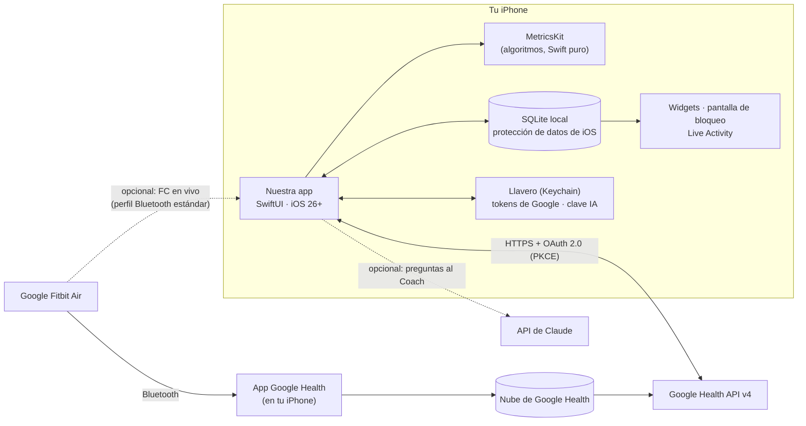
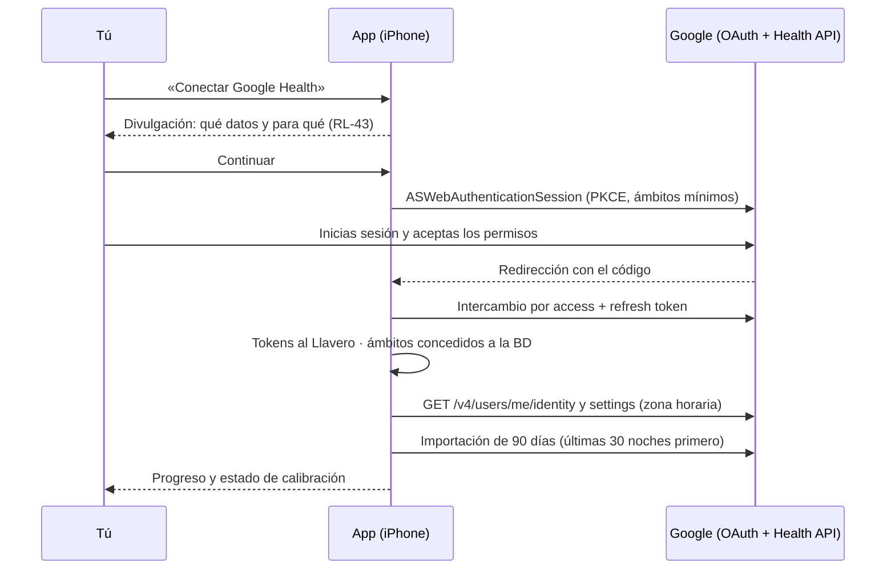

# 08 · Arquitectura técnica

Decisiones del propietario que la condicionan: **uso personal**, **solo iPhone**, **sin pagar Google Health Premium ni cuotas**, y **estética muy superior** a la de la app oficial. De ahí sale una arquitectura **nativa y *local-first***: una app SwiftUI que habla directamente con la Google Health API y lo calcula todo en el propio iPhone. **Sin servidor y sin coste mensual.**

## 1. Visión general



**Principios**

1. **Sin servidor propio**: nada que mantener ni pagar. La nube ya la pone Google (tus datos siguen allí y se pueden volver a descargar).
2. **Tus datos en tu iPhone**: base de datos local cifrada por iOS; solo salen hacia Google (lectura) y, si lo activas, hacia el Coach IA.
3. **Todo recalculable**: las puntuaciones se derivan de datos que siempre se pueden volver a descargar; solo el diario, los ajustes y las actividades manuales son «únicos» y tienen copia exportable.
4. **Nativo para lucir**: SwiftUI con el diseño actual de iOS (Liquid Glass), Swift Charts, SF Symbols, animaciones a 120 Hz, háptica, *widgets* y Live Activities (doc. 11).

## 2. Decisiones de arquitectura (resumen de ADR)

Cada decisión se documentará como ADR en `docs/adr/NNN-titulo.md` (RNF-MAN-05).

| ADR | Decisión | Alternativas consideradas | Motivo |
|---|---|---|---|
| 001 | **Google Health API v4 llamada directamente desde el iPhone** | Fitbit Web API (se apaga el 30/09/2026); Bluetooth propietario (rompe términos); Apple Health como fuente única (Google Health no escribe allí ni HRV ni temperatura) | Única vía oficial con todos los datos necesarios |
| 002 | **Sin backend (*local-first*)** | Backend en la nube con *webhooks* y *push* | Para un solo usuario, un servidor solo añade coste y mantenimiento; se pierde el aviso *push* instantáneo, que se sustituye por refresco en segundo plano y notificaciones locales |
| 003 | **App nativa SwiftUI para iOS 26+** | React Native/Expo; Flutter | Solo hay un iPhone: nativo da la mejor estética y fluidez, *widgets*, Live Activities, AlarmKit y Swift Charts sin puentes |
| 004 | **`MetricsKit` como paquete Swift puro y determinista** | Cálculo mezclado con la UI | Testeable (también en Linux/CI), reproducible (RNF-DIS-07), reutilizable en app y *widgets* |
| 005 | **SQLite con GRDB** | SwiftData / Core Data | Control fino de esquema, migraciones e inserciones masivas de series temporales; consultas SQL para tendencias |
| 006 | **OAuth con la librería oficial de Google para iOS** (Google Sign-In con ámbitos adicionales) o **AppAuth-iOS**; *tokens* en el Llavero | Implementación propia | Google solo admite sus librerías OAuth y el navegador del sistema (doc. 10 §4); se valida cuál funciona mejor con ámbitos restringidos en el *spike* |
| 007 | **Sincronización al abrir, manual y en segundo plano** (`BGAppRefreshTask` / `BGProcessingTask`) | *Webhooks* (requieren servidor) | Suficiente para uso personal; sin coste |
| 008 | **Notificaciones locales** (`UserNotifications`) | *Push* remotas (APNs) | Las *push* requieren servidor y cuenta de pago de Apple |
| 009 | **Coach IA opcional** con la API de Claude llamada por HTTPS desde la app, con **tu propia clave** guardada en el Llavero; herramientas que consultan la BD local | Sin Coach; servidor intermedio | Sin servidor y sin cuota: pagas solo lo que uses (céntimos por pregunta, doc. 06 §8); no hay SDK oficial de Anthropic para Swift, así que se usa la API HTTP directamente |
| 010 | **Instalación personal** sin App Store (§6) | Publicación en App Store | Uso personal (RL: no aplican las políticas de tiendas) |

## 3. Módulos

```
App (target iOS, SwiftUI)
├── Features/            Hoy · Sueño · Recuperación · Carga · Salud · Tendencias · Diario · Coach · Perfil
├── DesignSystem/        tokens, anillos/diales, tarjetas, estilos de gráficos, animaciones, háptica
Packages/
├── MetricsKit/          algoritmos del doc. 05 (sin E/S)
├── HealthAPI/           cliente de la Google Health API: OAuth, endpoints, paginación, límites, modelos
├── Store/               GRDB: esquema (doc. 09), migraciones, repositorios
├── Sync/                motor de sincronización y recálculo; tareas en segundo plano
├── Insights/            textos y recomendaciones deterministas (plantillas), informes
├── Coach/               opcional: bucle de herramientas con la API de Claude
└── HeartRateBLE/        opcional: FC en vivo por Bluetooth (CoreBluetooth)
Widgets (extensión)      WidgetKit (inicio, bloqueo, StandBy) + Live Activity/Dynamic Island (ActivityKit)
```

- Protocolo interno `HealthDataSource` (p. ej. `heartRate(range:)`, `sleepSessions(range:)`, `dailyHRV(range:)`) con la implementación `GoogleHealthAPISource` y, opcionalmente (F3), `AppleHealthSource` (HealthKit) como respaldo para FC, sueño y entrenamientos. El resto de la app solo ve el modelo normalizado del doc. 09.
- La app y la extensión de *widgets* comparten un contenedor de **App Group** con una instantánea ligera (JSON) de las puntuaciones del día; los *widgets* no abren la BD completa.

## 4. Flujos principales

### 4.1 Vinculación con Google



### 4.2 Mañana típica

1. Te despiertas; la pulsera sincroniza con la app Google Health y los datos llegan a la nube de Google.
2. **Opción A — en segundo plano**: una `BGAppRefreshTask` programada para tu hora habitual de despertar descarga el sueño y los vitales, calcula la recuperación y lanza la notificación local «Tu recuperación está lista». iOS decide el momento exacto (funciona mejor si abres la app a diario).
3. **Opción B — al abrir la app**: refresco inmediato (objetivo ≤ 3 s si los datos ya están en Google).
4. Si aún no hay sueño en la API: «Esperando sincronización: abre Google Health para enviar los datos de tu pulsera» con acceso directo a esa app.

### 4.3 Ciclo fisiológico

Como en WHOOP, el día no va de medianoche a medianoche: **un ciclo empieza al despertar del sueño principal y termina al despertar del siguiente**. La recuperación se asocia al inicio del ciclo, la carga se acumula durante todo el ciclo y el sueño que lo inicia pertenece a ese ciclo. Sin sueño principal, ciclo de reserva 04:00–04:00 (ALG-CIC-01).

### 4.4 Estrategia de sincronización

| Momento | Qué se descarga |
|---|---|
| Vinculación | 90 días de todos los tipos (FC con `rollUp` de 60 s en tramos de 14 días); continúa en `BGProcessingTask` si se cierra la app |
| Al abrir / *pull-to-refresh* / tarea en segundo plano | Últimas 48 h de cada tipo + cualquier hueco desde la última sincronización correcta |
| Nocturno (`BGProcessingTask`, cargando y con Wi-Fi) | Revisión de los últimos 7 días (datos editados o tardíos) y recálculo de líneas base |

La API no tiene *feed* de cambios, así que se re-consultan ventanas recientes; la ingesta es idempotente (RNF-DIS-03). Las cuotas (300 peticiones/min por usuario) quedan muy lejos. `pairedDevices.lastSyncTime` evita consultas inútiles si la pulsera no ha sincronizado.

## 5. Estructura del repositorio

```
FitbitApp/
├── project.yml            # XcodeGen o Tuist (proyecto reproducible y fácil de revisar en Git)
├── App/                   # Target iOS
├── Widgets/               # Extensión WidgetKit + Live Activity
├── Packages/              # MetricsKit, HealthAPI, Store, Sync, Insights, Coach, HeartRateBLE, DesignSystem
├── Config/                # Secrets.example.xcconfig (sin secretos reales)
├── Tests/                 # Tests de UI y snapshots
└── docs/                  # Esta especificación + ADR
```

Herramientas: Xcode 26+, Swift 6 (concurrencia estricta), Swift Testing/XCTest, SwiftLint + SwiftFormat, GitHub Actions (tests de los paquetes en Linux y macOS; *build* de la app en macOS opcional).

## 6. Compilación e instalación en tu iPhone (sin App Store)

| Opción | Coste | Qué implica |
|---|---|---|
| **A. Mac + Xcode + Apple ID gratuito** | 0 € | Instalas desde Xcode por cable o Wi-Fi. Con cuenta gratuita la app **caduca a los 7 días** y hay que reinstalarla (un clic en Xcode); límite de 3 apps propias; algunas capacidades no están disponibles en cuentas gratuitas [verificar *App Groups* para *widgets*] |
| **B. Mac + Apple Developer Program** | 99 $/año | Sin caducidad semanal (perfiles de 1 año o TestFlight), todas las capacidades |
| **C. Sin Mac** | 0 € (o B) | Se compila en GitHub Actions (macOS) un IPA sin firmar y se instala con **SideStore** usando tu Apple ID gratuito, que re-firma la app cada 7 días desde el propio iPhone [verificar configuración]; los tests de `MetricsKit` sí se pueden ejecutar en Linux |

Recomendación: empezar con **A** (o C si no tienes Mac) y pasar a **B** solo si la reinstalación semanal resulta molesta. Aun así, B cuesta menos que Premium de Google y no depende de nadie.

## 7. Si algún día se quisiera publicar (fuera de alcance)

Haría falta un backend (receptor de *webhooks* de Google, notificaciones *push*, cuentas de usuario), la verificación de Google con evaluación CASA anual (doc. 10 §2.2), cumplimiento completo del RGPD y de las políticas de la App Store (doc. 12 §5–§8). El diseño modular (`MetricsKit`, `HealthAPI`) permite reutilizar casi todo el código.
