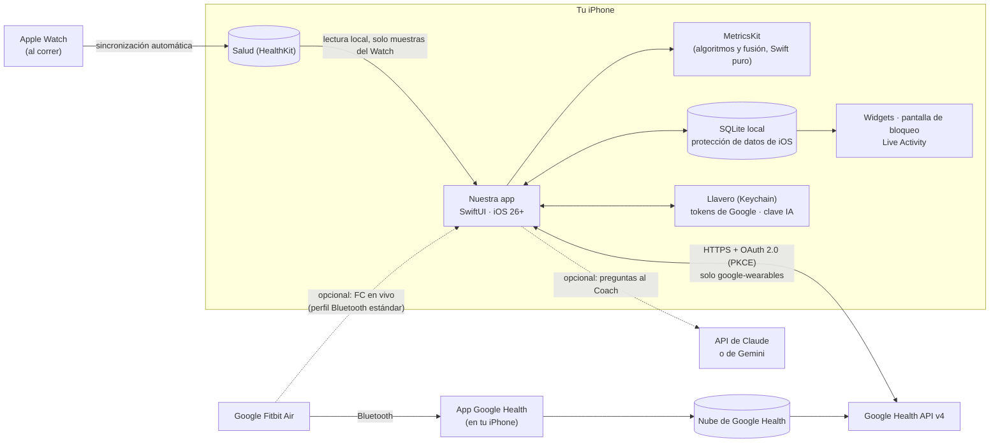
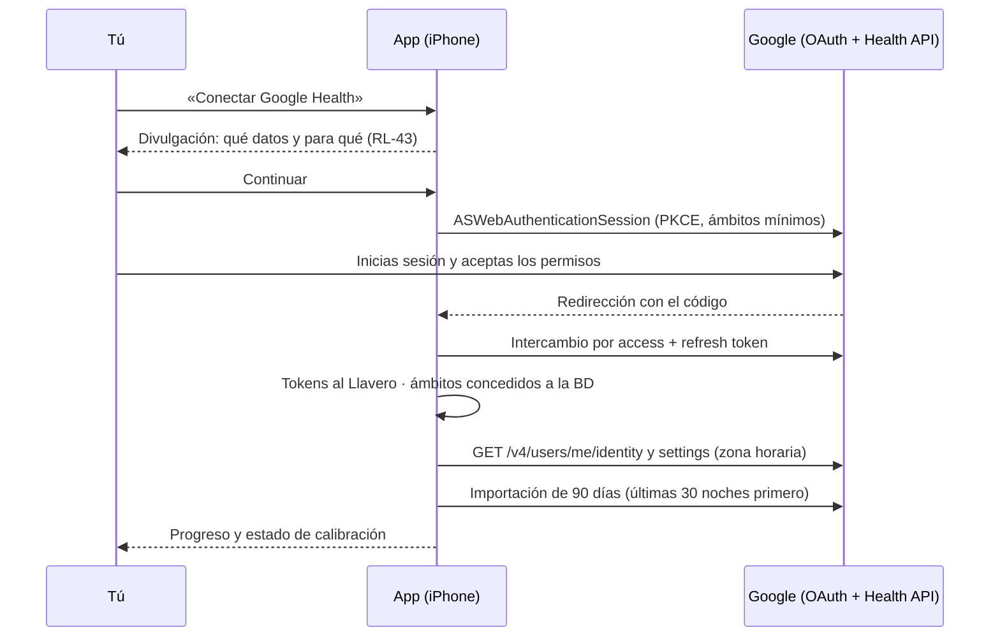
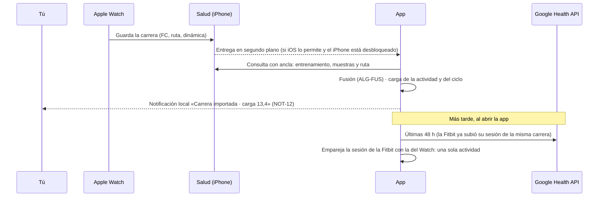
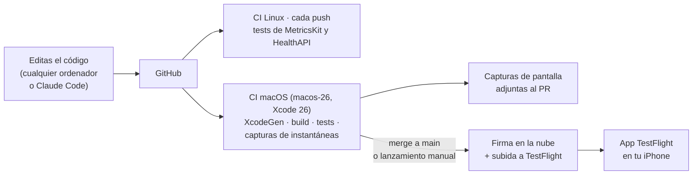

# 08 · Arquitectura técnica

Decisiones del propietario que la condicionan: **uso personal**, **solo iPhone**, **sin pagar Google Health Premium**, **estética muy superior** a la de la app oficial, **sin Mac** pero **con Apple Developer Program** (TestFlight), **Coach IA con Claude o Gemini** y **Apple Watch para correr** cuyos datos se fusionan con los de la Fitbit Air. De ahí sale una arquitectura **nativa y *local-first***: una app SwiftUI que habla directamente con la Google Health API, lee el Apple Watch de Salud (HealthKit) y lo calcula todo en el propio iPhone, compilada en la nube (GitHub Actions) e instalada con TestFlight. **Sin servidor y sin coste mensual obligatorio.**

## 1. Visión general



**Principios**

1. **Sin servidor propio**: nada que mantener ni pagar. La nube ya la pone Google (tus datos siguen allí y se pueden volver a descargar).
2. **Tus datos en tu iPhone**: base de datos local cifrada por iOS; solo se leen de Google y de Salud, y solo salen hacia el Coach IA si lo activas.
3. **Todo recalculable**: las puntuaciones se derivan de datos que siempre se pueden volver a descargar; solo el diario, los ajustes y las actividades manuales son «únicos» y tienen copia exportable.
4. **Nativo para lucir**: SwiftUI con el diseño actual de iOS (Liquid Glass), Swift Charts, SF Symbols, animaciones a 120 Hz, háptica, *widgets* y Live Activities (doc. 11).

## 2. Decisiones de arquitectura (resumen de ADR)

Cada decisión se documentará como ADR en `docs/adr/NNN-titulo.md` (RNF-MAN-05).

| ADR | Decisión | Alternativas consideradas | Motivo |
|---|---|---|---|
| 001 | **Google Health API v4 llamada directamente desde el iPhone** | Fitbit Web API (se apaga el 30/09/2026); Bluetooth propietario (rompe términos); Apple Health como fuente única (Google Health no escribe allí ni HRV ni temperatura) | Única vía oficial con todos los datos necesarios |
| 002 | **Sin backend (*local-first*)** | Backend en la nube con *webhooks* y *push* | Para un solo usuario, un servidor solo añade coste y mantenimiento; se pierde el aviso *push* instantáneo, que se sustituye por refresco en segundo plano y notificaciones locales |
| 003 | **App nativa SwiftUI para iOS 26+** | React Native/Expo; Flutter | Solo hay un iPhone: nativo da la mejor estética y fluidez, *widgets*, Live Activities, AlarmKit y Swift Charts sin puentes |
| 004 | **`MetricsKit` como paquete Swift puro y determinista** | Cálculo mezclado con la UI | Testeable (también en Linux/CI), reproducible (RNF-DIS-07), reutilizable en app y *widgets* |
| 005 | **SQLite con GRDB** | SwiftData / Core Data | Control fino de esquema, migraciones e inserciones masivas de series temporales; consultas SQL para tendencias |
| 006 | **OAuth con la librería oficial de Google para iOS** (Google Sign-In con ámbitos adicionales) o **AppAuth-iOS**; *tokens* en el Llavero | Implementación propia | Google solo admite sus librerías OAuth y el navegador del sistema (doc. 10 §4); se valida cuál funciona mejor con ámbitos restringidos en el *spike* |
| 007 | **Sincronización al abrir, manual y en segundo plano** (`BGAppRefreshTask` / `BGProcessingTask` para Google; consultas con ancla y entrega en segundo plano de HealthKit para el Apple Watch) | *Webhooks* (requieren servidor) | Suficiente para uso personal; sin coste |
| 008 | **Notificaciones locales** (`UserNotifications`) | *Push* remotas (APNs) | Las *push* requieren un servidor que las envíe |
| 009 | **Coach IA multiproveedor (Claude o Gemini)** llamado por HTTPS desde la app con **tu propia clave** en el Llavero, detrás de un protocolo `LLMProvider`; herramientas que consultan la BD local | Un solo proveedor; SDK de terceros; servidor intermedio | Libertad para usar la clave que tengas; sin servidor ni cuota; no hay SDK oficial de Anthropic para Swift y se evita añadir Firebase para Gemini (doc. 06 §3) |
| 010 | **Compilación en GitHub Actions (`macos-26`, Xcode 26) y distribución por TestFlight** | Mac propio; Xcode Cloud; instalación con cuenta gratuita | No hay Mac; la cuenta de Apple Developer permite TestFlight: sin caducidad semanal y con *builds* válidas 90 días (§6) |
| 011 | **Proyecto de Xcode generado con XcodeGen** desde `project.yml` | Editar el `.xcodeproj` a mano | Sin Mac no se puede usar el editor de proyectos de Xcode; un YAML legible se edita en cualquier editor y el proyecto se genera en CI |
| 012 | **Apple Watch leído de Salud (HealthKit) en el iPhone, solo lectura, y fusión propia en `MetricsKit`**; de Google, solo la familia `google-wearables` (doc. 16) | Dejar que Google Health importe el Watch desde Salud y leerlo todo por la API; app propia para Apple Watch | Local, inmediato y con todo el detalle (ruta, dinámica de carrera, FC de alta frecuencia), sin depender de cómo Google combine las fuentes; reglas de fusión transparentes y con tests. El Watch ya graba la carrera con la app Entreno, así que no hace falta una app para él (RF-W-09) |

## 3. Módulos

```
App (target iOS, SwiftUI)
├── Features/            Hoy · Sueño · Recuperación · Carga · Actividad/Carrera · Análisis del día · Salud · Tendencias · Diario · Coach · Perfil
├── DesignSystem/        tokens, anillos/diales, tarjetas, estilos de gráficos, mapas, animaciones, háptica
Packages/
├── MetricsKit/          algoritmos del doc. 05, incluidas la fusión de fuentes (ALG-FUS) y el análisis del día (sin E/S)
├── HealthAPI/           cliente de la Google Health API: OAuth, endpoints, paginación, límites, modelos
├── AppleHealth/         lector de HealthKit: permisos, consultas con ancla, entrega en segundo plano, filtro de origen (solo Apple Watch)
├── Store/               GRDB: esquema (doc. 09), migraciones, repositorios
├── Sync/                motor de sincronización y recálculo; tareas en segundo plano
├── Insights/            textos y recomendaciones deterministas (plantillas), informes
├── Coach/               opcional: CoachEngine + LLMProvider (Claude, Gemini)
└── HeartRateBLE/        opcional: FC en vivo por Bluetooth (CoreBluetooth)
Widgets (extensión)      WidgetKit (inicio, bloqueo, StandBy) + Live Activity/Dynamic Island (ActivityKit)
```

- Protocolo interno `HealthDataSource` (p. ej. `heartRate(range:)`, `workouts(range:)`, `sleepSessions(range:)`, `dailyHRV(range:)`) con dos implementaciones: `GoogleHealthAPISource` (Fitbit Air) y `AppleHealthSource` (Apple Watch, F2). Cada una escribe sus datos brutos con su `source`; la fusión (ALG-FUS, en `MetricsKit`) genera los datos derivados que ve el resto de la app (doc. 09).
- `AppleHealth` solo compila en plataformas de Apple (CI de macOS); la lógica de fusión está en `MetricsKit` y se prueba también en Linux.
- La app y la extensión de *widgets* comparten un contenedor de **App Group** con una instantánea ligera (JSON) de las puntuaciones del día; los *widgets* no abren la BD completa.

## 4. Flujos principales

### 4.1 Vinculación con Google



### 4.2 Mañana típica

1. Te despiertas; la pulsera sincroniza con la app Google Health y los datos llegan a la nube de Google.
2. **Opción A — en segundo plano**: una `BGAppRefreshTask` programada para tu hora habitual de despertar descarga el sueño y los vitales, calcula la recuperación y lanza la notificación local «Tu recuperación está lista». iOS decide el momento exacto (funciona mejor si abres la app a diario).
3. **Opción B — al abrir la app**: refresco inmediato (objetivo ≤ 3 s si los datos ya están en Google).
4. Si aún no hay sueño en la API: «Esperando sincronización: abre Google Health para enviar los datos de tu pulsera» con acceso directo a esa app.

### 4.3 Ciclo fisiológico

Como en WHOOP, el día no va de medianoche a medianoche: **un ciclo empieza al despertar del sueño principal y termina al despertar del siguiente**. La recuperación se asocia al inicio del ciclo, la carga se acumula durante todo el ciclo y el sueño que lo inicia pertenece a ese ciclo. Sin sueño principal, ciclo de reserva 04:00–04:00 (ALG-CIC-01).

### 4.4 Estrategia de sincronización

| Momento | Google Health API (Fitbit Air) | Salud (Apple Watch, doc. 16 §6) |
|---|---|---|
| Vinculación | 90 días de todos los tipos (FC con `rollUp` de 60 s en tramos de 14 días); continúa en `BGProcessingTask` si se cierra la app | 180 días de entrenamientos con sus muestras |
| **Al abrir o volver a la app** / *pull-to-refresh* | Últimas 48 h de cada tipo + cualquier hueco desde la última sincronización correcta | Consulta incremental con ancla por tipo (nuevos y borrados), en local |
| Tarea en segundo plano | `BGAppRefreshTask` matinal | Entrega en segundo plano al guardarse un entrenamiento |
| Nocturno (`BGProcessingTask`, cargando y con Wi-Fi) | Revisión de los últimos 7 días (datos editados o tardíos) y recálculo de líneas base | Revisión de 30 días (borrados perdidos, rutas añadidas después) |

Al abrir, las dos fuentes se sincronizan **en paralelo** (RF-SYN-09): Salud responde en local y se pinta primero; al llegar lo de Google se rehace la fusión de las ventanas afectadas y se recalculan las puntuaciones. La API de Google no tiene *feed* de cambios, así que se re-consultan ventanas recientes; la ingesta es idempotente (RNF-DIS-03). Las cuotas (300 peticiones/min por usuario) quedan muy lejos. `pairedDevices.lastSyncTime` evita consultas inútiles si la pulsera no ha sincronizado.

### 4.5 Después de correr con el Apple Watch



## 5. Estructura del repositorio

```
FitbitApp/
├── project.yml            # XcodeGen: definición del proyecto (el .xcodeproj se genera en CI y no se versiona)
├── App/                   # Target iOS
├── Widgets/               # Extensión WidgetKit + Live Activity
├── Packages/              # MetricsKit, HealthAPI, AppleHealth, Store, Sync, Insights, Coach, HeartRateBLE, DesignSystem
├── Config/                # Secrets.example.xcconfig (en CI, Secrets.xcconfig se genera desde los secretos de GitHub)
├── Tests/                 # Tests de UI e instantáneas
├── .github/workflows/     # ci-linux.yml (tests de paquetes) · ios.yml (build, instantáneas y TestFlight)
└── docs/                  # Esta especificación + ADR
```

Herramientas: Swift 6 (concurrencia estricta), XcodeGen, Swift Testing/XCTest, swift-snapshot-testing, SwiftLint + SwiftFormat, GitHub Actions. Para editar: cualquier ordenador con VS Code/Cursor y la extensión de Swift, o Claude Code.

## 6. Compilación, pruebas e instalación sin Mac (GitHub Actions + TestFlight)



**Tuberías**

1. **Linux, en cada *push*** (barato y rápido): `swift build` + `swift test` de los paquetes puros (`MetricsKit` y la lógica de `HealthAPI`). También se pueden ejecutar dentro de una sesión de Claude Code.
2. **macOS (`macos-26`, Xcode 26)** en los PR que tocan la interfaz y en `main`: genera el proyecto con XcodeGen, compila, ejecuta los tests (unitarios, UI e instantáneas en el simulador) y **adjunta las capturas de pantalla** como artefactos del PR. Así se revisa el diseño desde el navegador o el móvil, en lugar de las vistas previas de Xcode.
3. **TestFlight** (al hacer *merge* a `main` o a mano): archivo firmado en la nube con una **clave de API de App Store Connect** (firma gestionada por Xcode desde la línea de comandos) y subida a TestFlight; alternativa: fastlane [verificar el método en F0]. El número de *build* sale del número de ejecución.
4. **Instalación**: tú eres probador interno de tu propia app ⇒ sin revisión de Apple; la *build* aparece en la app TestFlight minutos después de procesarse. Cada *build* dura 90 días.
5. **Diagnóstico sin Mac**: informes de fallos y capturas enviadas desde TestFlight, métricas de rendimiento de MetricKit en el propio iPhone y registros locales exportables.

**Configuración inicial (todo en la web, sin Mac)**: identificador de la app y capacidades (App Groups para los *widgets*, HealthKit con entrega en segundo plano, AlarmKit [verificar requisitos]) en *Certificates, Identifiers & Profiles*; ficha de la app en App Store Connect; tú como probador interno; clave de API de App Store Connect con el rol mínimo que permita firmar y subir [verificar si la firma en la nube exige rol Admin]; secretos en GitHub Actions (doc. 15 §4).

**Minutos de CI** (el repositorio es **privado**): el plan gratuito de GitHub incluye 2 000 minutos al mes y los de macOS cuentan ×10, es decir, **≈ 200 minutos de macOS** (unas 10–15 compilaciones completas). Reglas: todo lo posible en Linux; macOS solo para PR de interfaz y `main`; caché de paquetes. Si no llega:

| Opción | Coste | Nota |
|---|---|---|
| Hacer público el repositorio | 0 € | Minutos ilimitados en los *runners* estándar; el repositorio no contiene datos personales (`.gitignore`), pero el código sería visible |
| GitHub Pro o minutos de pago | ~4 $/mes o por minuto | Más minutos incluidos |
| Xcode Cloud | Incluido (25 h/mes con el Apple Developer Program) | El primer flujo se crea desde Xcode: necesitarías un Mac una vez (p. ej. alquilado por horas) [verificar] |

## 7. Si algún día se quisiera publicar (fuera de alcance)

Haría falta un backend (receptor de *webhooks* de Google, notificaciones *push*, cuentas de usuario), la verificación de Google con evaluación CASA anual (doc. 10 §2.2), cumplimiento completo del RGPD y de las políticas de la App Store (doc. 12 §5–§8). El diseño modular (`MetricsKit`, `HealthAPI`) permite reutilizar casi todo el código.
