# 09 · Modelo de datos

Modelo **normalizado e independiente del proveedor**: el adaptador de la Google Health API (doc. 10) traduce sus recursos a estas tablas, y todo lo demás (métricas, app, Coach) trabaja solo con ellas. PostgreSQL 17/18.

Reglas generales:

- Todas las tablas de datos llevan `user_id` y están protegidas con *row-level security* (RNF-SEG-08).
- Marcas de tiempo en `timestamptz` (UTC) + `utc_offset_min` de la muestra cuando la fuente lo proporciona (RNF-I18N-03).
- Los datos de origen guardan `source` (`google_health`, `health_connect`, `manual`) y `source_record_id` / clave natural para ingesta idempotente (RNF-DIS-03).
- Los datos derivados guardan `algorithm_version` (RNF-CAL-05).

## 1. Diagrama entidad-relación (simplificado)

```mermaid
erDiagram
    users ||--|| user_settings : tiene
    users ||--o{ consents : otorga
    users ||--o{ provider_connections : vincula
    provider_connections ||--o{ sync_cursors : mantiene
    provider_connections ||--o{ sync_runs : registra
    users ||--o{ hr_minute : genera
    users ||--o{ hrv_samples : genera
    users ||--o{ daily_source_metrics : genera
    users ||--o{ sleep_sessions : duerme
    sleep_sessions ||--o{ sleep_stages : contiene
    users ||--o{ activities : realiza
    activities ||--o{ strength_sets : incluye
    users ||--o{ cycles : vive
    cycles ||--o| recovery_scores : "puntúa"
    cycles ||--o| strain_scores : "acumula"
    cycles ||--o| stress_daily : resume
    sleep_sessions ||--o| sleep_scores : "evalúa"
    activities ||--o| activity_strain : "carga"
    users ||--o{ baselines : calcula
    users ||--o{ journal_answers : responde
    journal_questions ||--o{ journal_answers : pregunta
    users ||--o{ behavior_impacts : obtiene
    users ||--o{ reports : recibe
    users ||--o{ coach_threads : conversa
    coach_threads ||--o{ coach_messages : contiene
```

## 2. Identidad, configuración y conexiones

| Tabla | Campos principales | Notas |
|---|---|---|
| `users` | `id` (uuid), `email`, `display_name`, `birth_date`, `sex` (`male`/`female`/`unspecified`), `height_cm`, `weight_kg`, `locale`, `units`, `time_zone` (IANA actual), `created_at`, `deleted_at` | `deleted_at` marca borrado lógico previo a la purga (RNF-PRI-04) |
| `user_settings` | `user_id`, `theme`, `notifications` (jsonb por tipo), `quiet_hours`, `lockscreen_values` (bool), `hr_zones` (jsonb), `hr_max_override`, `sleep_goal` (`peak`/`perform`/`get_by`), `wake_times` (jsonb por día de la semana), `journal_questions_enabled` (int[]) | |
| `consents` | `id`, `user_id`, `type` (`privacy_policy`, `wellness_disclaimer`, `health_processing`, `ai_coach`, `analytics`), `version`, `granted_at`, `revoked_at`, `method` | Histórico, nunca se sobrescribe (RL-11) |
| `provider_connections` | `id`, `user_id`, `provider`, `external_user_id` (`healthUserId` de Google, usado para enlazar los *webhooks*), `granted_scopes` (text[]), `access_token_enc`, `refresh_token_enc`, `wrapped_dek`, `token_expires_at`, `status` (`active`/`needs_reauth`/`revoked`/`error`), `last_success_sync_at`, `device_last_sync_at` | *Tokens* con cifrado de sobre (RNF-SEG-04) |
| `webhook_events` | `id`, `received_at`, `health_user_id`, `data_type`, `operation`, `intervals` (jsonb), `status`, `processed_at` | Cola de notificaciones recibidas; deduplicación e idempotencia (doc. 10 §6.2) |
| `sync_cursors` | `connection_id`, `data_type`, `cursor` / `synced_until`, `updated_at` | Un cursor por tipo de dato |
| `sync_runs` | `id`, `connection_id`, `kind` (`backfill`/`incremental`/`manual`/`notification`), `started_at`, `finished_at`, `status`, `records_upserted`, `error_code` | Observabilidad y soporte |
| `devices` | `id`, `user_id`, `provider_device_id`, `model`, `last_sync_at`, `battery_level` | Si la API expone dispositivos |

## 3. Datos de origen normalizados

| Tabla | Granularidad | Campos principales | Clave única |
|---|---|---|---|
| `hr_minute` | 1 min — **serie base de FC**, obtenida con `rollUp` de 60 s (doc. 10 §5.4) | `user_id`, `minute_ts`, `bpm_avg`, `bpm_min`, `bpm_max`, `utc_offset_min`, `source` | (`user_id`, `source`, `minute_ts`) |
| `hr_samples` | 1 s, **solo dentro de sesiones de ejercicio** | `user_id`, `ts`, `bpm` (smallint), `activity_id`, `source` | (`user_id`, `source`, `ts`) |
| `steps_minute` | 1 min | `user_id`, `minute_ts`, `steps`, `source` | (`user_id`, `source`, `minute_ts`) |
| `hrv_samples` | Muestras nocturnas (cadencia a verificar en el *spike*) | `user_id`, `ts`, `rmssd_ms`, `sdnn_ms`, `source` | (`user_id`, `source`, `ts`) |
| `daily_source_metrics` | Diaria | `user_id`, `date` (local), `metric` (enum abierta, ver abajo), `value`, `unit`, `details` (jsonb), `source` | (`user_id`, `source`, `date`, `metric`) |
| `sleep_sessions` | Sesión | `id`, `user_id`, `source`, `source_record_id`, `start_ts`, `end_ts`, `utc_offset_min`, `is_main`, `time_in_bed_min`, `asleep_min`, `awake_min`, `efficiency_src`, `latency_min`, `has_stages`, `source_updated_at` | (`user_id`, `source`, `source_record_id`) |
| `sleep_stages` | Segmento | `session_id`, `start_ts`, `end_ts`, `stage` (`wake`/`light`/`deep`/`rem`/`asleep`/`restless`) | (`session_id`, `start_ts`) |
| `activities` | Sesión | `id`, `user_id`, `source`, `source_record_id`, `type`, `name`, `start_ts`, `end_ts`, `utc_offset_min`, `avg_hr`, `max_hr`, `calories_kcal`, `distance_m`, `steps`, `is_manual`, `rpe` (0–10), `notes` | (`user_id`, `source`, `source_record_id`) |
| `strength_sets` | Serie | `activity_id`, `exercise`, `set_index`, `reps`, `weight_kg`, `rpe` | (`activity_id`, `set_index`) |

Valores iniciales de `daily_source_metrics.metric` y su tipo de origen en la Google Health API (doc. 03 §4):

| `metric` | Tipo de origen |
|---|---|
| `resting_hr` | `daily-resting-heart-rate` |
| `hrv_rmssd_avg`, `hrv_rmssd_deep`, `nrem_hr`, `hrv_entropy` | `daily-heart-rate-variability` |
| `spo2_avg`, `spo2_lower`, `spo2_upper` | `daily-oxygen-saturation` |
| `resp_rate`, `resp_rate_light`, `resp_rate_deep`, `resp_rate_rem` | `daily-respiratory-rate`, `respiratory-rate-sleep-summary` |
| `skin_temp_nightly_c`, `skin_temp_provider_baseline_c`, `skin_temp_provider_sd_c` | `daily-sleep-temperature-derivations` |
| `vo2max`, `run_vo2max` | `daily-vo2-max`, `run-vo2-max` |
| `steps`, `distance_m`, `calories_kcal`, `active_minutes`, `active_zone_minutes` | `dailyRollUp` de los tipos de actividad |
| `weight_kg`, `height_cm` | Perfil / medidas, si se conceden |

Se amplía sin migración de esquema (enum en tabla de referencia). Los nombres exactos de los campos de origen se fijan tras el *spike* de F0.

## 4. Datos derivados

| Tabla | Campos principales |
|---|---|
| `cycles` | `id`, `user_id`, `start_ts`, `end_ts` (null si abierto), `time_zone`, `sleep_session_id`, `is_fallback` |
| `baselines` | `user_id`, `metric`, `as_of_date`, `window_days`, `mean`, `sd`, `median`, `mad`, `n`, `algorithm_version` |
| `recovery_scores` | `cycle_id`, `user_id`, `score` (0–100), `zone`, `confidence`, `components` (jsonb: z-score y aportación de cada componente), `inputs` (jsonb), `algorithm_version`, `computed_at` |
| `strain_scores` | `cycle_id`, `user_id`, `strain` (0–21, 1 decimal), `load_raw` (TRIMP), `zone_minutes` (jsonb), `target_low`, `target_high`, `confidence`, `algorithm_version`, `computed_at` |
| `activity_strain` | `activity_id`, `strain`, `load_raw`, `zone_minutes`, `srpe`, `algorithm_version` |
| `sleep_scores` | `sleep_session_id`, `user_id`, `need_min`, `need_breakdown` (jsonb), `performance`, `debt_min`, `sri_7d`, `efficiency`, `restorative_min`, `restorative_pct`, `algorithm_version` |
| `stress_windows` | `user_id`, `start_ts` (ventana de 5 min), `level` (0–3), `excluded_reason` (`sleep`/`exercise`/`motion`/`no_data`) |
| `stress_daily` | `cycle_id`, `avg_level`, `min_low`, `min_medium`, `min_high` |
| `health_flags` | `user_id`, `date`, `out_of_range` (text[]), `z_scores` (jsonb), `notified_at` |
| `physio_age_estimates` | `user_id`, `as_of_date`, `estimate_years`, `ci_low`, `ci_high`, `chronological_age`, `factors` (jsonb), `algorithm_version` |
| `algorithm_params` | `version`, `params` (jsonb), `created_at`, `notes` |

## 5. Diario, informes, Coach y auditoría

| Tabla | Campos principales |
|---|---|
| `journal_questions` | `id`, `key`, `text_es`, `text_en`, `answer_type` (`bool`/`number`/`scale_1_5`), `category`, `owner_user_id` (null = catálogo) |
| `journal_answers` | `user_id`, `date`, `question_id`, `value_bool`, `value_num`, `note`, `answered_at` — único por (`user_id`, `date`, `question_id`) |
| `behavior_impacts` | `user_id`, `question_id`, `effect`, `ci_low`, `ci_high`, `n_yes`, `n_no`, `method`, `computed_at` |
| `reports` | `id`, `user_id`, `type` (`weekly`/`monthly`), `period_start`, `period_end`, `content` (jsonb), `ai_content` (jsonb), `created_at` |
| `coach_threads` | `id`, `user_id`, `title`, `created_at`, `deleted_at` |
| `coach_messages` | `id`, `thread_id`, `role`, `content` (jsonb), `tool_calls` (jsonb), `model`, `input_tokens`, `output_tokens`, `cache_read_tokens`, `rating`, `feedback`, `created_at` |
| `coach_memory` | `user_id`, `key` (objetivo, preferencia, restricción), `value` (jsonb), `updated_at` |
| `notifications_log` | `id`, `user_id`, `type`, `sent_at`, `status` |
| `audit_log` | `id`, `user_id`, `actor`, `action`, `at`, `metadata` (sin datos de salud) |

## 6. Volumen y retención

| Dato | Volumen por usuario | Retención por defecto (RNF-PRI-03) |
|---|---|---|
| `hr_minute` | 1 440 filas/día ≈ 0,5 M/año | 24 meses (configurable); particionado mensual y borrado por partición |
| `hr_samples` (1 s en entrenamientos) | ~3 600 filas por hora de ejercicio | Igual que `hr_minute` |
| `steps_minute`, `hrv_samples` | ≤ 1 440 filas/día | Igual que `hr_minute` |
| Sueño, actividades, datos diarios, derivados | < 100 filas/día | Mientras exista la cuenta |
| Conversaciones del Coach | Variable | 12 meses o hasta que el usuario las borre |
| Copias de seguridad | — | 30 días (RNF-DIS-06) |

Regla de granularidad (RL-44): al vencer la retención se **borra** el dato; nunca se sustituye por un agregado de menor resolución. Los agregados diarios que calcula la app (puntuaciones) son datos derivados, no sustitutos del dato de origen.

## 7. Formato de exportación (RF-PRI-01)

Archivo ZIP con:

- `profile.json`, `settings.json`, `consents.json`
- `sleep_sessions.csv`, `sleep_stages.csv`, `activities.csv`, `daily_source_metrics.csv`, `hr_minute.csv`, `hr_samples.csv`, `hrv_samples.csv`, `steps_minute.csv`
- `scores/recovery.csv`, `scores/strain.csv`, `scores/sleep.csv`, `scores/stress_daily.csv`
- `journal.csv`, `reports/*.json`, `coach/*.json`
- `README.txt` con la descripción de cada columna y la versión de algoritmos.
