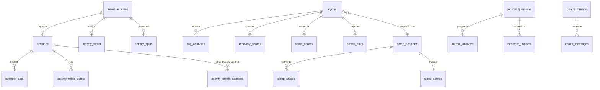

# 09 · Modelo de datos

Base de datos **local en el iPhone** (SQLite con GRDB, doc. 08 ADR 005), de **un solo usuario**. Los módulos `HealthAPI` (Google Health API, Fitbit Air) y `AppleHealth` (Salud, Apple Watch) traducen sus datos a estas tablas y todo lo demás (métricas, pantallas, *widgets*, Coach) trabaja solo con ellas.

Reglas generales:

- Marcas de tiempo en UTC (`INTEGER` en segundos o `TEXT` ISO 8601) + `utc_offset_min` de la muestra (RNF-I18N-03).
- Los datos de origen guardan `source` (`google_health` = Fitbit Air, `apple_health` = Apple Watch, `manual`) y una clave natural única para que la ingesta sea idempotente (RNF-DIS-03). Cada fuente guarda sus datos brutos por separado; la **fusión** (ALG-FUS, doc. 16) produce tablas derivadas (§4) que se pueden rehacer en cualquier momento.
- Los datos derivados guardan `algorithm_version` (RNF-CAL-05) y se pueden recalcular por completo.
- Fichero con protección de datos de iOS (RNF-SEG-03). **Los *tokens* y la clave de la IA no están en la BD**, sino en el Llavero (RNF-SEG-02).

## 1. Diagrama entidad-relación (simplificado)

## 2. Perfil, ajustes y conexión

| Tabla | Campos principales | Notas |
|---|---|---|
| `profile` (1 fila) | `birth_date`, `sex` (`male`/`female`/`unspecified`), `height_cm`, `weight_kg`, `waist_cm` (opcional, ALG-EDA-02), `activity_index` (opcional), `sports` | |
| `settings` (1 fila) | `units`, `theme`, `notifications` (JSON por tipo), `quiet_hours`, `lockscreen_values`, `hr_zones`, `hr_max_override`, `sleep_goal`, `wake_times` (por día de la semana), `journal_questions_enabled`, `coach_enabled`, `coach_mode` (`personal`/`educativo`), `coach_provider` (`anthropic`/`gemini`), `coach_model`, `coach_daily_limit`, `gemini_paid_tier_confirmed`, `exclude_from_icloud_backup`, `healthkit_enabled`, `hr_workout_priority` (`apple_watch`/`fitbit_air`, RF-FUS-07) | Las claves de IA no están aquí, sino en el Llavero |
| `connection` (1 fila) | `health_user_id`, `granted_scopes`, `status` (`active`/`needs_reauth`/`revoked`), `connected_at`, `last_success_sync_at`, `device_last_sync_at`, `time_zone` (de `settings` de Google), `healthkit_connected_at`, `healthkit_last_import_at`, `healthkit_earliest_authorized` (iOS 27+) | Sin *tokens* (están en el Llavero) |
| `hk_anchors` | `sample_type`, `anchor` (BLOB), `updated_at` | Una fila por tipo de Salud: ancla de la consulta incremental (doc. 16 §6) |
| `sync_state` | `data_type`, `synced_until`, `last_run_at`, `last_error` | Una fila por tipo de dato (reanudable, RNF-DIS-02) |
| `sync_log` | `id`, `started_at`, `finished_at`, `source` (`google_health`/`apple_health`), `kind` (`backfill`/`open`/`background`/`manual`/`nightly`), `status`, `records_upserted`, `error_code` | Diagnóstico local, sin datos de salud |
| `algorithm_params` | `version`, `params` (JSON del doc. 05 §12), `activated_at` | |

## 3. Datos de origen normalizados

| Tabla | Granularidad | Campos principales | Clave única |
|---|---|---|---|
| `hr_minute` | 1 min, una fila por fuente — Fitbit: `rollUp` de 60 s (doc. 10 §5.4); Watch: media de sus muestras del minuto y `n_samples` | `minute_ts`, `bpm_avg`, `bpm_min`, `bpm_max`, `n_samples`, `utc_offset_min`, `source` | (`source`, `minute_ts`) |
| `hr_samples` | Alta resolución, **solo en entrenamientos** (1 s en la Fitbit; la del Watch tal como la guarda Salud) | `ts`, `bpm`, `activity_id`, `source` | (`source`, `ts`) |
| `steps_minute` | 1 min | `minute_ts`, `steps`, `source` | (`source`, `minute_ts`) |
| `hrv_samples` | Muestras nocturnas (cadencia a verificar en el *spike*) | `ts`, `rmssd_ms`, `sdnn_ms`, `source` | (`source`, `ts`) |
| `daily_source_metrics` | Diaria | `date` (local), `metric`, `value`, `unit`, `details` (JSON), `source` | (`source`, `date`, `metric`) |
| `sleep_sessions` | Sesión | `id`, `source`, `source_record_id`, `start_ts`, `end_ts`, `utc_offset_min`, `is_main`, `time_in_bed_min`, `asleep_min`, `awake_min`, `latency_min`, `has_stages`, `source_updated_at` | (`source`, `source_record_id`) |
| `sleep_stages` | Segmento | `session_id`, `start_ts`, `end_ts`, `stage` (`wake`/`light`/`deep`/`rem`/`asleep`) | (`session_id`, `start_ts`) |
| `activities` | Sesión de una fuente (la del Watch usa el UUID del entrenamiento de Salud como `source_record_id`) | `id`, `source`, `source_record_id`, `source_bundle_id`, `source_product_type`, `type`, `name`, `start_ts`, `end_ts`, `utc_offset_min`, `avg_hr`, `max_hr`, `calories_kcal`, `distance_m`, `steps`, `elevation_gain_m`, `has_route`, `avg_power_w`, `avg_speed_mps`, `avg_stride_m`, `avg_vertical_osc_cm`, `avg_ground_contact_ms`, `hr_recovery_1min`, `effort_score`, `is_manual`, `rpe` (0–10), `notes` | (`source`, `source_record_id`) |
| `activity_route_points` | Punto de la ruta del Watch | `activity_id`, `ts`, `lat`, `lon`, `alt_m`, `speed_mps`, `h_accuracy_m` | (`activity_id`, `ts`) |
| `activity_metric_samples` | Muestras de dinámica de carrera del Watch | `activity_id`, `ts`, `metric` (`power_w`/`speed_mps`/`stride_m`/`vertical_osc_cm`/`ground_contact_ms`), `value` | (`activity_id`, `metric`, `ts`) |
| `strength_sets` | Serie | `activity_id`, `exercise`, `set_index`, `reps`, `weight_kg`, `rpe` | (`activity_id`, `set_index`) |

Valores de `daily_source_metrics.metric` y su origen en la Google Health API (doc. 03 §4):

| `metric` | Tipo de origen |
|---|---|
| `resting_hr` | `daily-resting-heart-rate` |
| `hrv_rmssd_avg`, `hrv_rmssd_deep`, `nrem_hr`, `hrv_entropy` | `daily-heart-rate-variability` |
| `spo2_avg`, `spo2_lower`, `spo2_upper` | `daily-oxygen-saturation` |
| `resp_rate`, `resp_rate_light`, `resp_rate_deep`, `resp_rate_rem` | `daily-respiratory-rate`, `respiratory-rate-sleep-summary` |
| `skin_temp_nightly_c`, `skin_temp_provider_baseline_c`, `skin_temp_provider_sd_c` | `daily-sleep-temperature-derivations` |
| `vo2max`, `run_vo2max` | `daily-vo2-max`, `run-vo2-max` (Google); `vo2max` también con `source = apple_health` (`vo2Max` de Salud), en su propia serie (ALG-FUS-06) |
| `steps`, `distance_m`, `calories_kcal`, `active_minutes`, `active_zone_minutes` | `dailyRollUp` de los tipos de actividad |

Los nombres exactos de los campos de origen se fijan tras el *spike* de F0.

## 4. Datos derivados

| Tabla | Campos principales |
|---|---|
| `cycles` | `id`, `start_ts`, `end_ts` (null si abierto), `time_zone`, `sleep_session_id`, `is_fallback` |
| `baselines` | `metric`, `as_of_date`, `window_days`, `median`, `mad`, `n`, `algorithm_version` |
| `recovery_scores` | `cycle_id`, `score`, `zone`, `confidence`, `components` (JSON), `inputs` (JSON), `algorithm_version`, `computed_at` |
| `strain_scores` | `cycle_id`, `strain`, `load_raw`, `zone_minutes` (JSON), `target_low`, `target_high`, `confidence`, `algorithm_version`, `computed_at` |
| `hr_minute_fused` | `minute_ts`, `bpm_avg`, `source` (la elegida, ALG-FUS-03), `algorithm_version` — serie única para carga, zonas y estrés |
| `fused_activities` | `id` (estable: el del entrenamiento del Watch si lo hay), `member_activity_ids` (JSON), `start_ts`, `end_ts`, `type`, `sources` (JSON), `hr_source`, `sources_disagree`, `algorithm_version` — una fila por actividad que ves (ALG-FUS-02); el RPE y las notas se leen de sus miembros |
| `activity_splits` | `fused_activity_id`, `index`, `distance_m`, `duration_s`, `avg_hr`, `elevation_gain_m` (parciales por km o milla, calculados de la ruta y la distancia) |
| `activity_strain` | `fused_activity_id`, `strain`, `load_raw`, `zone_minutes`, `srpe`, `algorithm_version` |
| `sleep_scores` | `sleep_session_id`, `need_min`, `need_breakdown` (JSON), `sufficiency`, `performance`, `debt_min`, `sri_7d`, `efficiency`, `restorative_min`, `restorative_pct`, `algorithm_version` |
| `stress_windows` | `start_ts` (ventana de 5 min), `level` (0–3), `excluded_reason` |
| `stress_daily` | `cycle_id`, `avg_level`, `min_low`, `min_medium`, `min_high` |
| `health_flags` | `date`, `signals` (JSON), `notified_at` |
| `physio_age_estimates` | `as_of_date`, `estimate_years`, `band_low`, `band_high`, `pace`, `factors` (JSON), `algorithm_version` |
| `day_analyses` | `id`, `cycle_id`, `created_at`, `kind` (`deterministic`/`ai`), `content` (JSON con el esquema de ALG-ANA-01), `sources` (JSON), `data_until_ts`, `provider`, `model`, `algorithm_version` (RF-ANA-04) |
| `widget_snapshot` (fichero JSON en el App Group) | Puntuaciones del ciclo actual para los *widgets* y la pantalla de bloqueo |

## 5. Diario, informes y Coach

| Tabla | Campos principales |
|---|---|
| `journal_questions` | `id`, `key`, `text_es`, `text_en`, `answer_type` (`bool`/`number`/`scale_1_5`), `category`, `is_custom` |
| `journal_answers` | `date`, `question_id`, `value_bool`, `value_num`, `note`, `answered_at` — único por (`date`, `question_id`) |
| `behavior_impacts` | `question_id`, `effect`, `ci_low`, `ci_high`, `n_yes`, `n_no`, `computed_at` |
| `reports` | `id`, `type` (`weekly`/`monthly`), `period_start`, `period_end`, `content` (JSON), `ai_content` (JSON, opcional) |
| `goals` | `id`, `kind`, `target`, `period`, `created_at`, `active` (objetivos y plan semanal) |
| `coach_threads` / `coach_messages` | `id`, `title`, `provider` (`anthropic`/`gemini`), `model`, `created_at` / `thread_id`, `role`, `model` (el que respondió, por si hubo *fallback*), `content` (JSON con los bloques **tal como los devolvió el proveedor**, incluidos los de razonamiento, para reenviarlos sin cambios), `tool_calls` (JSON), `input_tokens`, `output_tokens`, `cache_read_tokens`, `cache_write_tokens`, `cost_usd_est`, `rating`, `created_at` — un hilo pertenece a un único proveedor y a un único modelo elegido (RF-COA-22) |
| `coach_memory` | `category` (objetivos, estilo de vida, preferencias, eventos, salud declarada), `key`, `value`, `updated_at` |
| `privacy_events` | `at`, `action` (vinculación, desvinculación, exportación, borrado, Coach activado/desactivado) |

## 6. Volumen y retención

| Dato | Volumen | Retención por defecto |
|---|---|---|
| `hr_minute` | 1 440 filas/día ≈ 0,5 M/año (≈ 30–50 MB/año) | 24 meses (configurable) |
| `hr_samples` (entrenamientos) | ~3 600 filas por hora de ejercicio | Igual que `hr_minute` |
| `activity_route_points`, `activity_metric_samples` (carreras del Watch) | Unos miles de filas por hora de carrera | Igual que `hr_minute` |
| `steps_minute`, `hrv_samples` | ≤ 1 440 filas/día | Igual que `hr_minute` |
| Sueño, actividades, datos diarios, derivados, diario | < 100 filas/día | Indefinida |
| Conversaciones del Coach | Variable | Hasta que las borres |

Tamaño total esperado: **< 200 MB en 2 años**. Regla de granularidad (RL-44): al vencer la retención se **borra** el dato; nunca se sustituye por un agregado de menor resolución.

## 7. Exportación y copia de seguridad (RF-PRI-01, RF-ONB-05)

Archivo ZIP compartible (Archivos, iCloud Drive, AirDrop) con:

- `profile.json`, `settings.json`, `goals.json`
- `sleep_sessions.csv`, `sleep_stages.csv`, `activities.csv`, `fused_activities.csv`, `strength_sets.csv`, `daily_source_metrics.csv`, `hr_minute.csv`, `hr_samples.csv`, `hrv_samples.csv`, `steps_minute.csv`, `activity_metric_samples.csv`
- `routes/*.gpx` (una ruta por carrera del Watch)
- `scores/recovery.csv`, `scores/strain.csv`, `scores/sleep.csv`, `scores/stress_daily.csv`
- `journal.csv`, `reports/*.json`, `day_analyses/*.json`, `coach/*.json`
- `README.txt` con la descripción de cada columna y la versión de algoritmos.

La **copia de restauración** mínima incluye solo lo que no se puede volver a descargar de Google ni de Salud: perfil, ajustes, objetivos, diario, actividades manuales, RPE y notas de las actividades, series de fuerza y (opcional) conversaciones del Coach. Ojo: Salud condensa las muestras de los entrenamientos antiguos, así que la FC de alta resolución de carreras de hace meses solo está completa en la exportación completa.
