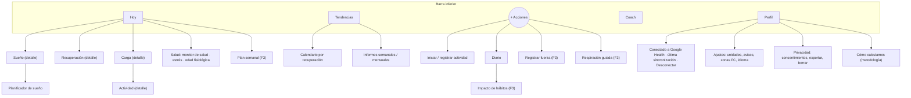

# 11 · Experiencia de usuario y pantallas

## 1. Principios de diseño

1. **Diez segundos**: al abrir la app, en la pantalla «Hoy» se entiende el día sin tocar nada (tres diales + una recomendación).
2. **Cada número se explica**: todo valor tiene «¿Qué es?» y «¿Por qué hoy es así?» a ≤ 2 toques (RNF-ACC-07).
3. **Honestidad con la incertidumbre**: estados de calibración, confianza de los datos y datos pendientes de sincronizar siempre visibles; nunca una cifra inventada (RNF-CAL-02).
4. **Color + texto + forma**: las zonas usan color, etiqueta y forma a la vez (RNF-ACC-02).
5. **Sin culpa**: lenguaje de acompañamiento («Hoy toca recuperar») en vez de juicio («Has fallado»).
6. **Bienestar, no medicina**: vocabulario permitido del doc. 12 (RL-02).
7. **Oscuro primero**: tema oscuro por defecto (uso matinal/nocturno), tema claro completo.
8. **Identidad propia**: se replica la idea funcional de WHOOP, no su imagen (RL-61).

## 2. Arquitectura de información



El botón central **«+»** agrupa las acciones de registro (como el botón de acciones de WHOOP). El Coach se puede abrir también desde cualquier pantalla de detalle con su contexto (RF-COA-17).

## 3. Pantalla «Hoy» (boceto)

```
┌──────────────────────────────────────────┐
│  ‹  Lunes 28 sep  ›          ⟳ hace 4 min │
│                                          │
│   ◯ SUEÑO        ◯ RECUPERACIÓN   ◯ CARGA │
│     92 %            72 %          8,4    │
│   7 h 41 min      ● ALTA          obj.   │
│   de 8 h 20       +6 vs media   12–15    │
│                                          │
│ ┌──────────────────────────────────────┐ │
│ │ ✦ Hoy tu cuerpo está preparado para  │ │
│ │ un esfuerzo alto. Objetivo de carga  │ │
│ │ 12–15. Acuéstate hacia las 23:10.    │ │
│ └──────────────────────────────────────┘ │
│                                          │
│ Vitales de la noche           vs. normal │
│ VFC 58 ms ▲  FCR 51 ▼  FR 14,2 =         │
│ SpO₂ 96 % =  Temp. +0,1 °C =             │
│                                          │
│ Estrés  ▁▂▂▃▅▂▁▁   medio 1,1 (bajo)      │
│                                          │
│ Actividades                              │
│ 🏃 Carrera 45 min · carga 11,2 · 07:10    │
│                                          │
│ Diario: 3 preguntas pendientes  ›        │
│ Esta noche: acuéstate a las 23:10  ›     │
│                                          │
│ Mi panel  (VFC · Pasos · Zonas · Sueño…) │
└──────────────────────────────────────────┘
  Hoy   Tendencias   (+)   Coach   Perfil
```

Comportamiento:

- Deslizar lateralmente o flechas ‹ › para ver días anteriores; «Hoy» siempre vuelve al ciclo actual.
- Diales: anillo de progreso con el valor en el centro. Sueño = rendimiento de sueño % (compuesto), Recuperación = % con color de zona, Carga = 0–21 con **banda de carga objetivo** superpuesta en el anillo.
- Cabecera: indicador «Google Health · sincronizado hace X» (RL-46) y, si aplica, racha (RF-TEN-04).
- «Mi panel»: tarjetas de métricas que el usuario elige y ordena; cada una abre su tendencia.
- «Esta noche»: acceso directo al planificador de sueño.
- Tocar un dial abre su detalle. Mantener pulsado muestra la explicación breve.
- La tarjeta de recomendación es determinista en F1–F2 (plantillas) y generada por el Coach en F3 (RF-COA-05).

## 4. Pantallas de detalle

| Pantalla | Contenido | Fase |
|---|---|---|
| **Sueño** | Rendimiento de sueño % y sus submétricas con banda óptimo/suficiente/bajo (suficiencia: horas dormidas vs necesidad con desglose base + carga + deuda − siestas; eficiencia; constancia SRI de 7 días), hipnograma por fases, tiempo en cada fase y % reparador, latencia, despertares, FR nocturna, deuda acumulada, siestas | F1 (fases, suficiencia, eficiencia) / F2 (deuda, constancia, planificador) |
| **Planificador de sueño** | Modo «Alcanzar mi necesidad» (hora de despertar por día de la semana y objetivo «Máximo 100 %», «Rendir 85 %», «Mínimo 70 %») o «Mejorar mi constancia»; hora recomendada para acostarse y recordatorio | F2 |
| **Recuperación** | Puntuación y zona; contribución de cada componente frente a tu línea base (barras divergentes: VFC, FCR, sueño, FR, temperatura, SpO₂); tendencia de 30 días; carga objetivo; confianza y días de calibración | F1 |
| **Carga** | Carga del ciclo y objetivo; minutos por zona de FC; curva de FC del día; lista de actividades con su carga; carga semanal y relación carga aguda/crónica | F1 (carga diaria) / F2 (resto) |
| **Actividad** | Tipo, duración, FC media/máx., curva de FC con zonas, carga de actividad, calorías, distancia/ritmo si existen, esfuerzo percibido (RPE 0–10) editable, notas | F2 |
| **Estrés** | Línea temporal 0–3 del día, tiempo en bajo/medio/alto, episodios destacados, contexto (actividad vs no actividad), comparación con tu media | F2 |
| **Monitor de salud** | Vitales nocturnos con **rango habitual personal** (banda) y valor de hoy; aviso si varias métricas se salen del rango («Tus métricas nocturnas están fuera de tu rango habitual») con recomendaciones de bienestar | F2 |
| **Tendencias** | Selector de métrica y periodo (7 d, 30 d, 90 d, 6 meses, 1 año); medias móviles; comparación entre dos métricas (p. ej. carga vs recuperación); calendario mensual coloreado por recuperación | F2 |
| **Plan semanal** | Objetivos de la semana, barra de progreso, revisión del viernes | F3 |
| **Informes** | Semanal (F2) y mensual (F3): resumen, récords, comparativas, recomendaciones | F2/F3 |
| **Edad fisiológica** | Estimación, factores que suman/restan años, evolución trimestral, fuertes avisos de incertidumbre | F3 |
| **Diario** | Preguntas sí/no y numéricas de ayer (alcohol, cafeína tarde, pantallas, comida tardía, estrés percibido, autoevaluación de recuperación 1–5…), personalizables | F2 |
| **Impacto de hábitos** | Efecto de cada hábito sobre tu recuperación (± puntos, IC, nº de días) | F3 |
| **Coach** | Chat en *streaming*, preguntas sugeridas, «Datos usados», valoración de respuestas, etiqueta de IA | F3 |

## 5. Onboarding

1. Bienvenida y propuesta de valor (3 pantallas máx.).
2. Aviso de bienestar y privacidad en lenguaje claro (RL-04).
3. Crear cuenta: Sign in with Google / Apple.
4. Perfil: fecha de nacimiento, sexo (para fórmulas de carga y FC máx.; con opción «prefiero no decirlo» → coeficientes neutros), altura, peso, deportes principales, hora habitual de despertar.
5. Conectar **Google Health**: pantalla de divulgación («{App} recopila datos de salud y actividad física para calcular tu recuperación, tu carga diaria y tu sueño, y para ofrecerte recomendaciones personalizadas») → navegador del sistema con el consentimiento de Google → vuelta a la app. Si el usuario no ha configurado la app Google Health, se le guía primero (RF-CON-08).
6. Consentimiento explícito de tratamiento de datos de salud (RL-10) — en uso personal, confirmación simplificada.
7. Permiso de notificaciones (explicando cuáles se enviarán).
8. Importación del historial con barra de progreso y resumen («Hemos encontrado 86 noches»). Si hay ≥ 4 noches válidas en el historial, la recuperación está disponible desde el primer día.
9. Primer «Hoy» con estados de calibración si faltan datos.

Objetivo: completar en ≤ 3 min (RNF-ACC-06).

## 6. Estados especiales (obligatorios en todas las pantallas de métricas)

| Estado | Mensaje de ejemplo | Acción |
|---|---|---|
| Calibrando | «Estamos conociendo tu cuerpo: 2 de 4 noches» | Explicación de la calibración |
| Esperando sincronización | «Aún no hemos recibido tu sueño. Abre Google Health para sincronizar la pulsera.» | Botón que abre la app Google Health |
| Datos antiguos | «Última actualización hace 9 h» | *Pull-to-refresh* |
| Sin datos | «No llevabas la pulsera esta noche» | — |
| Confianza baja | Icono y texto «Datos parciales (58 % de la noche)» | Detalle del motivo |
| Conexión caducada/revocada | «Necesitamos que vuelvas a conectar Google Health» | Botón de reconexión |
| Sin conexión | Banner «Sin conexión: mostrando datos guardados» | — |

## 7. Catálogo de notificaciones

| ID | Disparador | Ejemplo | Por defecto | Fase |
|---|---|---|---|---|
| NOT-01 | Recuperación calculada | «Tu recuperación de hoy está lista» (con cifra solo si el usuario lo activa) | Activada | F1 |
| NOT-02 | Hora de acostarse (planificador) | «Para dormir 8 h 20 min, acuéstate en 30 min» | Activada si usa el planificador | F2 |
| NOT-03 | Carga objetivo alcanzada | «Has alcanzado tu carga objetivo de hoy» | Desactivada | F2 |
| NOT-04 | Vitales fuera de rango | «Tus métricas nocturnas están fuera de tu rango habitual. Tómatelo con calma.» | Activada | F2 |
| NOT-05 | Informe disponible | «Tu informe semanal está listo» | Activada | F2 |
| NOT-06 | Sin datos 24 h | «No recibimos datos desde ayer. ¿Está cargada y sincronizada tu pulsera?» | Activada | F1 |
| NOT-07 | Conexión con Google caducada/revocada | «Reconecta Google Health para seguir recibiendo datos» | Siempre | F1 |
| NOT-08 | Recordatorio del diario | «¿Cómo fue ayer? 3 preguntas rápidas» | Desactivada | F2 |
| NOT-09 | Estrés alto sostenido | «Llevas un rato con estrés alto. ¿Un minuto de respiración?» | Desactivada | F2 |
| NOT-10 | Resumen de estrés / revisión del día | «Hoy: estrés medio 1,2. Acuéstate entre 23:00 y 23:20» | Desactivada | F2/F3 |
| NOT-11 | Plan semanal | «Vas al 60 % de tu plan semanal» (viernes) | Activada si hay plan | F3 |

Reglas: máximo 3 notificaciones no críticas al día; respetar horas de silencio configurables (por defecto 22:30–07:00 salvo NOT-02); ningún dato de salud en el texto visible en pantalla de bloqueo salvo que el usuario lo active.

## 8. Sistema visual (propuesta inicial)

| Token | Uso | Oscuro | Claro |
|---|---|---|---|
| `color.recovery.high` | Recuperación alta (67–100) | `#3DDC84` | `#157F3B` |
| `color.recovery.medium` | Recuperación media (34–66) | `#FFD23F` | `#8A6A00` |
| `color.recovery.low` | Recuperación baja (0–33) | `#FF5C5C` | `#B3261E` |
| `color.strain` | Carga | `#4DA3FF` | `#1D5FB8` |
| `color.sleep` | Sueño | `#B38CFF` | `#6B3FC8` |
| `color.stress` | Estrés | `#FF9F43` | `#A65A00` |
| `color.bg` / `color.surface` | Fondos | `#0B0D10` / `#15181D` | `#FFFFFF` / `#F4F5F7` |

- Validar todos los pares con RNF-ACC-03 antes de congelar la paleta; las zonas de recuperación van siempre con etiqueta «Alta/Media/Baja» e icono de forma distinta (●, ◆, ▲).
- Tipografía del sistema (SF Pro / Roboto) con cifras tabulares para números; soporte de tamaño dinámico.
- Gráficos: sin 3D, ejes con unidades, bandas grises para el «rango habitual», etiquetas de valor accesibles (RNF-ACC-05).
- Vibración háptica del **móvil** en interacciones clave (no de la pulsera).

## 9. *Widgets* (F3)

- iOS (WidgetKit) y Android (Glance/App Widgets): tamaño pequeño con los tres diales; mediano con diales + recomendación. Respetan la opción de privacidad de pantalla de bloqueo.

## 10. Guía de redacción

- Tuteo, frases cortas, verbos de acción («Acuéstate a las 23:10»).
- Números con su referencia («58 ms, +6 sobre tu media»).
- Nunca: diagnósticos, alarmismo, culpa. Siempre: incertidumbre explicada y derivación a profesionales cuando corresponda.
- Glosario de términos visibles consistente con [glosario.md](glosario.md).
