# 11 · Experiencia de usuario, diseño y pantallas

La estética es un **objetivo principal**: la app debe verse y sentirse claramente mejor que la app oficial de Google Health. Se diseña **solo para iPhone** con SwiftUI y el lenguaje visual de iOS 26 (Liquid Glass).

## 1. Principios

1. **Diez segundos**: al abrir la app, la pantalla «Hoy» explica el día sin tocar nada: tres anillos y una recomendación.
2. **Calma y foco**: pocas cosas por pantalla, mucho aire, jerarquía tipográfica clara. Sin muros de texto generados por IA (una de las críticas a la app oficial).
3. **Cada número se explica**: «¿Qué es?» y «¿Por qué hoy es así?» a ≤ 2 toques (RNF-ACC-07).
4. **Honestidad**: calibración, confianza y datos pendientes siempre visibles; nunca una cifra inventada (RNF-CAL-02).
5. **Color + texto + forma**: las zonas usan color, etiqueta e icono a la vez (RNF-ACC-02).
6. **Sin culpa y sin diagnósticos**: «Hoy toca recuperar», nunca «Has fallado»; vocabulario del doc. 12 (RL-02).
7. **Oscuro primero**: tema oscuro por defecto (uso al despertar y al acostarse), tema claro igual de cuidado.
8. **Identidad propia**: la idea funcional de WHOOP (anillos, zonas), no su imagen (RL-61).

## 2. Dirección de arte

| Elemento | Especificación |
|---|---|
| Ambiente | Oscuro profundo y sobrio, con color solo donde hay información (las tres métricas). Sensación *premium* y tranquila |
| Anillos | Tres anillos gruesos con degradado angular del color de la métrica, extremo redondeado y brillo sutil; se llenan con animación de muelle al abrir (≈ 0,8 s), con retardo escalonado entre ellos |
| Cifras | SF Pro Rounded, grandes y con cifras tabulares; transiciones numéricas animadas (`contentTransition(.numericText())`) |
| Materiales | Liquid Glass de iOS 26 en la barra de pestañas, barras de navegación, hojas y botones flotantes; tarjetas sobre fondo sólido para no perder legibilidad |
| Iconografía | SF Symbols (con animaciones de símbolo en estados: sincronizando, listo, error) |
| Gráficos | Swift Charts: áreas con degradado, barras redondeadas, banda gris para «tu rango habitual», selección con arrastre y háptica suave |
| Movimiento | Transiciones con *matched geometry* de «Hoy» al detalle (el anillo «vuela» a su pantalla); respeta «Reducir movimiento» |
| Háptica | Del iPhone: suave al completar la sincronización, marcada al alcanzar la carga objetivo o al tener la recuperación lista |
| Icono de app | Tres arcos concéntricos con los colores de las métricas sobre fondo oscuro (variantes oscura, clara y tintada de iOS) |

Referencias de inspiración (solo para calidad, no para copiar): WHOOP, Apple Fitness y Salud, Oura, Bevel, Gentler Streak.

## 3. Arquitectura de información

```mermaid
flowchart TB
    subgraph Tabs["Barra de pestañas (Liquid Glass)"]
        HOY["Hoy"]
        TEN["Tendencias"]
        COA["Coach"]
        PER["Perfil"]
    end
    MAS(("+ Acciones"))
    HOY --> SUE["Sueño"]
    HOY --> REC["Recuperación"]
    HOY --> CAR["Carga"]
    CAR --> ACT["Actividad · Carrera (mapa, parciales)"]
    HOY --> ANA["Análisis del día"]
    HOY --> SAL["Salud: monitor · estrés · edad fisiológica"]
    HOY --> PLS["Plan semanal (F3)"]
    SUE --> PLA["Planificador de sueño"]
    TEN --> CAL["Calendario por recuperación"]
    TEN --> INF["Informes semanales / mensuales"]
    MAS --> NAC["Iniciar / registrar actividad"]
    MAS --> DIA["Diario"]
    MAS --> FUE["Registrar fuerza (F3)"]
    MAS --> RES["Respiración guiada (F3)"]
    DIA --> IMP["Impacto de hábitos (F3)"]
    PER --> CON["Fuentes de datos: Fitbit Air (Google Health) · Apple Watch (Apple Health) · última sincronización · Desconectar"]
    PER --> AJU["Ajustes: unidades, avisos, zonas de FC, Face ID"]
    PER --> CIA["Coach IA: proveedor (Claude/Gemini), clave, modelo, límite de gasto"]
    PER --> PRI["Privacidad: exportar, borrar todo"]
    PER --> MET["Cómo calculamos"]
```



El botón flotante **«+»** agrupa las acciones de registro. El Coach también se abre desde cualquier detalle con su contexto (RF-COA-17).

## 4. Pantalla «Hoy»

```
┌──────────────────────────────────────────┐
│ Lunes 28 sep        ◉ Fitbit Air · 6:52  │
│                     ⌚ Apple Watch · 18:40│
│                                          │
│      ╭───╮        ╭─────╮        ╭───╮   │
│      │92%│        │ 72% │        │8,4│   │
│      ╰───╯        ╰─────╯        ╰───╯   │
│      SUEÑO    RECUPERACIÓN ●ALTA   CARGA  │
│   7 h 41 de 8 h 20  +6 vs media  obj 12–15│
│                                          │
│ ┌──────────────────────────────────────┐ │
│ │ ✦ Buen día para apretar. Objetivo    │ │
│ │ de carga 12–15. Acuéstate a las 23:10│ │
│ └──────────────────────────────────────┘ │
│                                          │
│ Vitales de la noche           vs. normal │
│ VFC 58 ms ▲  FCR 51 ▼  FR 14,2 =         │
│ SpO₂ 96 % =  Temp. +0,1 °C =             │
│                                          │
│ Estrés  ▁▂▂▃▅▂▁▁   medio 1,1 (bajo)      │
│ Actividades  🏃 Carrera 8,2 km · 5:12/km │
│              45 min · carga 11,2  ⌚+◉    │
│ Esta noche: acuéstate a las 23:10    ›   │
│ ┌──────────────────────────────────────┐ │
│ │        ✦ Analizar mi día             │ │
│ └──────────────────────────────────────┘ │
│ Mi panel  (VFC · Pasos · Zonas · Sueño…) │
└──────────────────────────────────────────┘
   Hoy     Tendencias     Coach     Perfil   (+)
```

- El anillo central (Recuperación) es algo mayor que los laterales.
- Deslizar lateralmente para días anteriores; «Hoy» vuelve al ciclo actual.
- Anillo de Carga con la **banda objetivo** superpuesta.
- Recomendación del día: plantillas deterministas y gratuitas (F1–F2); redactada por el Coach si está activado (F3, RF-COA-05).
- **Cabecera con el estado de cada fuente** (Fitbit Air y Apple Watch). Al abrir la app o volver a ella se sincronizan las dos sin tocar nada (RF-SYN-09): lo de Apple Health aparece al instante y lo de Google, en cuanto llega, con una animación suave de los anillos y las cifras.
- Las actividades muestran su fuente: ⌚ Apple Watch, ◉ Fitbit Air o las dos si se han fusionado (RF-FUS-01/03).
- Botón **«Analizar mi día»** (RF-ANA-01): abre el análisis en una hoja; con el Coach activado, con «Seguir preguntando».
- «Mi panel»: tarjetas de métricas elegibles y reordenables, cada una abre su tendencia.

## 5. Pantallas de detalle

| Pantalla | Contenido | Fase |
|---|---|---|
| **Sueño** | Rendimiento de sueño y submétricas con banda óptimo/suficiente/bajo (suficiencia con desglose de la necesidad, eficiencia, constancia), hipnograma, tiempo por fase y % reparador, latencia, despertares, FR, deuda y siestas | F1 / F2 |
| **Planificador de sueño** | «Alcanzar mi necesidad» (hora de despertar por día y objetivo 100/85/70 %) o «Mejorar mi constancia»; hora recomendada, recordatorio y alarma opcional (AlarmKit) | F2 / F3 |
| **Recuperación** | Puntuación y zona; contribución de cada componente frente a tu base (barras divergentes); tendencia de 30 días; carga objetivo; confianza y calibración | F1 |
| **Carga** | Carga y objetivo; minutos por zona; curva de FC del día; actividades con su carga; carga aguda y crónica | F1 / F2 |
| **Actividad** | Tipo, duración, FC media/máx., curva de FC por zonas, carga, RPE editable, notas y fuentes (con aviso si las dos pulseras no coinciden) | F2 |
| **Carrera** (Apple Watch) | Mapa de la ruta coloreado por ritmo o zona de FC; distancia, tiempo, ritmo medio y parciales por km; desnivel; cadencia, potencia, zancada, oscilación vertical y contacto con el suelo; FC por zonas y carga; FC de recuperación a 1 min; esfuerzo de Apple y tu RPE (RF-ENT-08) | F2 |
| **Análisis del día** | Titular; 3–5 claves con su tono (positivo ◆, a vigilar ▲); tus actividades; «Esta noche» y «Mañana»; «Datos usados» con su fuente; hasta qué hora hay datos; «Seguir preguntando» al Coach (F3) | F2 / F3 |
| **Fuentes de datos** | Fitbit Air (Google Health) y Apple Watch (Apple Health): estado, última sincronización, qué aporta cada una, preferencia de FC en entrenamientos y «Cómo evitamos duplicados» (RF-FUS-07, RF-CON-09) | F2 |
| **Salud** | Vitales nocturnos con tu rango habitual y avisos; estrés del día (0–3); edad fisiológica y ritmo de envejecimiento (F3) | F2 / F3 |
| **Tendencias** | Métrica y periodo (7 d – 1 año), medias móviles, comparación de dos métricas, calendario coloreado por recuperación, informes | F2 |
| **Plan semanal** | Objetivos, progreso, revisión del viernes | F3 |
| **Diario** | Preguntas rápidas de ayer (sí/no, cantidad, 1–5) + autoevaluación | F2 |
| **Impacto de hábitos** | Efecto de cada hábito en tu recuperación (± puntos, IC, días) | F3 |
| **Coach** | Chat en *streaming*, preguntas sugeridas, «Datos usados», etiqueta de IA con proveedor y modelo, coste estimado del mes | F3 |
| **Ajustes del Coach** | Proveedor (Claude o Gemini) y modelo, clave de cada uno (se guarda en el Llavero), «Probar conexión», confirmación de nivel de pago en Gemini, límite diario, modo solo educativo, memoria | F3 |

## 6. Onboarding (≤ 3 min, RNF-ACC-08)

1. Bienvenida (2–3 pantallas animadas con los anillos).
2. Aviso breve: bienestar, no medicina; tus datos se quedan en tu iPhone.
3. Perfil: fecha de nacimiento, sexo (o «prefiero no decirlo»), altura, peso, deportes, hora habitual de despertar.
4. **Conectar Google Health**: divulgación → consentimiento de Google en el navegador del sistema → vuelta a la app (RF-CON-01). Si falta el perfil de Google Health, guía para configurarlo (RF-CON-08).
5. **¿Corres con Apple Watch?** (opcional): «Conectar Apple Health» abre la hoja de permisos de iOS solo con los tipos de lectura necesarios (RF-CON-06). Se puede hacer más tarde desde Ajustes › Fuentes de datos.
6. Permiso de notificaciones (explicando cuáles).
7. Importación del historial con animación de progreso («Hemos encontrado 86 noches y 23 carreras»). Con ≥ 4 noches válidas, la recuperación ya está disponible.
8. Primer «Hoy» (con estados de calibración si faltan datos). Sugerencia de añadir el *widget*.

## 7. Estados especiales (en todas las pantallas de métricas)

| Estado | Mensaje de ejemplo | Acción |
|---|---|---|
| Calibrando | «Estamos conociendo tu cuerpo: 2 de 4 noches» | Explicación |
| Esperando sincronización | «Aún no ha llegado tu sueño. La Fitbit Air sincronizó por última vez a las 23:10: abre Google Health para enviar sus datos.» | Botón «Abrir Google Health» (enlace universal documentado `https://www.fitbit.com/in-app/today`; al abrirse, Google Health sincroniza la pulsera si está cerca) |
| Apple Health sin datos | «No vemos entrenamientos del Apple Watch. Si corres con él, revisa Salud › Compartir › Apps › {app}.» | Ayuda paso a paso (iOS no revela si se denegó el permiso) |
| Fuentes que no coinciden | «En esta carrera, la FC del Apple Watch y la de la Fitbit Air difieren. Usamos la del Watch.» | Cambiar la preferencia (RF-FUS-07) |
| Datos antiguos | «Última actualización hace 9 h» | *Pull-to-refresh* |
| Sin datos | «No llevabas la pulsera esta noche» | — |
| Confianza baja | «Datos parciales (58 % de la noche)» | Detalle del motivo |
| Reconectar | «Vuelve a conectar Google Health para seguir recibiendo datos» | Botón de reconexión (1 toque) |
| Sin conexión | «Sin conexión: mostrando datos guardados» | — |

## 8. Notificaciones (locales)

| ID | Disparador | Ejemplo | Por defecto | Fase |
|---|---|---|---|---|
| NOT-01 | Recuperación calculada (en segundo plano) | «Tu recuperación de hoy está lista» (cifra solo si lo activas) | Activada | F1 |
| NOT-02 | Hora de acostarse (planificador) | «Para dormir 8 h 20 min, acuéstate en 30 min» | Activada si usas el planificador | F2 |
| NOT-03 | Carga objetivo alcanzada (tras sincronizar) | «Has alcanzado tu carga objetivo de hoy» | Desactivada | F2 |
| NOT-04 | Vitales fuera de rango | «Tus métricas nocturnas están fuera de tu rango habitual. Tómatelo con calma.» | Activada | F2 |
| NOT-05 | Informe disponible | «Tu informe semanal está listo» | Activada | F2 |
| NOT-06 | Sin datos 24 h | «No llegan datos desde ayer. ¿Está cargada y sincronizada la pulsera?» | Activada | F1 |
| NOT-07 | Conexión con Google caducada/revocada | «Vuelve a conectar Google Health» | Siempre | F1 |
| NOT-08 | Recordatorio del diario | «¿Cómo fue ayer? 3 preguntas rápidas» | Desactivada | F2 |
| NOT-09 | Estrés alto sostenido | «Llevas un rato con estrés alto. ¿Un minuto de respiración?» | Desactivada | F2 |
| NOT-10 | Resumen de estrés / análisis del día (RF-ANA-05) | «Tu análisis de hoy está listo: buen día de carga. Acuéstate entre 23:00 y 23:20» | Desactivada | F2/F3 |
| NOT-11 | Plan semanal | «Vas al 60 % de tu plan semanal» (viernes) | Activada si hay plan | F3 |
| NOT-12 | Carrera nueva del Apple Watch importada (en segundo plano o al abrir, RF-SYN-11) | «Carrera de 8,2 km importada · carga 13,4» | Activada | F2 |

Reglas: máximo 3 no críticas al día, horas de silencio (22:30–07:00 salvo NOT-02) y sin cifras en la pantalla de bloqueo salvo que lo actives. Las que dependen de datos nuevos solo pueden salir cuando iOS ejecuta la tarea en segundo plano o al abrir la app (doc. 10 §6).

## 9. Sistema de diseño

### 9.1 Tokens de color (propuesta inicial)

| Token | Uso | Oscuro | Claro |
|---|---|---|---|
| `recovery.high` | Recuperación alta (67–100) | `#3DDC84` | `#157F3B` |
| `recovery.medium` | Recuperación media (34–66) | `#FFD23F` | `#8A6A00` |
| `recovery.low` | Recuperación baja (0–33) | `#FF5C5C` | `#B3261E` |
| `strain` | Carga | `#4DA3FF` | `#1D5FB8` |
| `sleep` | Sueño | `#B38CFF` | `#6B3FC8` |
| `stress` | Estrés | `#FF9F43` | `#A65A00` |
| `bg` / `surface` / `surfaceElevated` | Fondos | `#07080A` / `#121418` / `#1B1E24` | `#FFFFFF` / `#F4F5F7` / `#FFFFFF` |
| `textPrimary` / `textSecondary` | Texto | `#F5F6F8` / `#9AA0AA` | `#0B0D10` / `#5B616B` |

Todos los pares se validan con RNF-ACC-03 antes de congelar la paleta; las zonas llevan siempre etiqueta e icono (●, ◆, ▲).

### 9.2 Tipografía y espaciado

- Cifras protagonistas: SF Pro Rounded (Bold, 44–64 pt); títulos: SF Pro Display; texto: SF Pro Text; todo con tipo dinámico.
- Retícula de 4/8 pt; márgenes laterales de 16–20 pt; radios de 20–28 pt en tarjetas.

### 9.3 Componentes

`RingDial` (anillo con banda objetivo opcional), `MetricCard`, `VitalRow` (valor + flecha vs. base), `RangeBandChart`, `Hypnogram`, `ZoneBar`, `InsightCard`, `EmptyState`, `ConfidenceBadge`. Como no hay Mac (sin vistas previas de Xcode), cada componente tiene **tests de instantánea** en claro/oscuro y varios tamaños de letra cuyas capturas se revisan en el PR (RNF-EST-05), y se valida en el iPhone vía TestFlight.

### 9.4 Checklist de revisión de diseño (antes de dar por terminada una pantalla)

- [ ] Solo tokens del sistema de diseño (RNF-EST-01).
- [ ] Se entiende en 10 s; una sola acción principal.
- [ ] Estados vacío, cargando, error y calibrando diseñados.
- [ ] Animaciones sin tirones (RNF-EST-02) y con «Reducir movimiento».
- [ ] Contraste y VoiceOver verificados.
- [ ] Probado en oscuro, claro y con letra grande.

## 10. *Widgets*, pantalla de bloqueo y Live Activities

| Elemento | Contenido | Fase |
|---|---|---|
| *Widget* pequeño (inicio) | Tres anillos | F2 |
| *Widget* mediano (inicio) | Tres anillos + recomendación del día | F2 |
| Pantalla de bloqueo | Circular (recuperación) y rectangular (tres valores); modo StandBy | F2 |
| Live Activity / Dynamic Island | Entrenamiento en curso: tiempo, zona, FC en vivo o carga | F3 |

Todos respetan el ajuste de privacidad de la pantalla de bloqueo (RF-WID-04).

## 11. Guía de redacción

- Tuteo, frases cortas, verbos de acción («Acuéstate a las 23:10»).
- Números con su referencia («58 ms, +6 sobre tu media»).
- Nunca diagnósticos, alarmismo ni culpa; incertidumbre explicada y, si hace falta, «consulta a un profesional sanitario».
- Términos coherentes con el [glosario](glosario.md).
