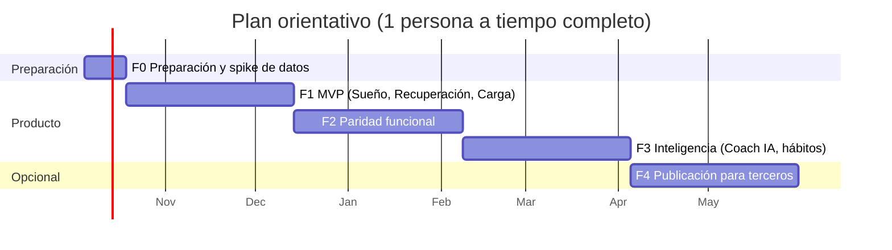

# 14 · Plan de proyecto, backlog y riesgos

Estimaciones en **semanas de una persona a tiempo completo**; a media jornada, multiplicar por ~2. Son órdenes de magnitud para planificar, no compromisos.

## 1. Fases e hitos

| Hito | Criterio de salida |
|---|---|
| **H0 · Datos reales** (fin F0) | Con la cuenta del propietario se leen por la API y se guardan: sesiones de sueño con fases, HRV nocturna, FC en reposo, FC intradía, SpO₂, FR, temperatura, actividad. Informe del *spike* con granularidad, latencia y huecos (actualiza el doc. 03). |
| **H1 · Primera mañana** (fin F1) | Durante 7 días seguidos la recuperación se calcula sola al despertar y llega la notificación; la pantalla Hoy muestra los tres diales y sus detalles. |
| **H2 · Paridad** (fin F2) | Funciones M y S de F2 del doc. 04 terminadas; algoritmos `1.0.0` calibrados con ≥ 30 días de datos (doc. 13 §6). |
| **H3 · Coach** (fin F3) | Coach IA supera los umbrales de evaluación (doc. 13 §7); impacto de hábitos visible. |
| **H4 · Publicación** (fin F4) | Verificación de Google aprobada, lista legal RL-* de F4 completada, apps aprobadas en tiendas. |

## 2. Backlog por épicas

| Épica | Contenido (requisitos) | Fase | Esfuerzo |
|---|---|---|---|
| E0 · Preparación | Cuentas y proyecto de Google Cloud, pantalla de consentimiento OAuth, acceso a la API, *spike* de datos, repositorio, CI, ADR, tokens de diseño, borrador de política de privacidad (doc. 15) | F0 | 2 sem |
| E1 · Cuenta y onboarding | RF-ONB-01..04, RF-PER-01, RF-PER-04 | F1 | 1 sem |
| E2 · Conexión y sincronización | RF-CON-01..04/08, RF-SYN-01..07, RNF-SEG-04/05/10, *webhooks* | F1 | 2,5 sem |
| E3 · Motor de métricas v0 | Líneas base, sueño principal, necesidad, suficiencia y rendimiento de sueño, recuperación, carga diaria (ALG-BAS, SUE-00..02/06/07, REC-01, CAR-01/06) + tests | F1 | 2 sem |
| E4 · Pantallas Hoy y detalles | Diales, detalle de Sueño/Recuperación/Carga, estados especiales, vitales | F1 | 1,5 sem |
| E5 · Notificaciones y privacidad básica | NOT-01/06/07, RF-NOT-03, RF-PRI-02/03 (básico) | F1 | 1 sem |
| E6 · Entrenamientos y carga avanzada | RF-CAR-02..06, RF-ENT-01..04/06 | F2 | 2 sem |
| E7 · Sueño avanzado | RF-SUE-06..10 (deuda, constancia, planificador, siestas) | F2 | 1,5 sem |
| E8 · Estrés y monitor de salud | RF-EST-01..04, RF-SAL-02..05 | F2 | 1,5 sem |
| E9 · Diario | RF-DIA-01..05 | F2 | 1 sem |
| E10 · Tendencias e informe semanal | RF-TEN-01..04, RF-INF-01, RF-PRI-01 | F2 | 2 sem |
| E11 · Coach IA | RF-COA-01..20, suite de evaluación | F3 | 3,5 sem |
| E12 · Hábitos, plan semanal e informes IA | RF-DIA-06, RF-PLA-01..03, RF-INF-02/03 | F3 | 2 sem |
| E13 · Edad fisiológica, fuerza y salud | RF-EDA-01/02, RF-ENT-05, RF-EST-05, RF-SAL-06 | F3 | 2 sem |
| E14 · Health Connect, *widgets* y FC en vivo | RF-CON-06, *widgets* iOS/Android, RF-ENT-07 | F3 | 2 sem |
| E15 · Publicación | Verificación de Google/CASA, EIPD, DPA, tiendas, pentest, soporte (RL-* F4) | F4 | 6–10 sem (gran parte es espera de terceros) |

### Historias de usuario representativas

- **E2** — *Como* usuario de Fitbit Air, *quiero* conectar mi cuenta de Google una sola vez *para* que mis datos aparezcan solos cada mañana.
- **E3** — *Como* deportista, *quiero* ver un % de recuperación comparado con mi propia normalidad *para* decidir si entreno fuerte hoy.
- **E6** — *Como* corredor, *quiero* saber cuánta carga llevo y cuál es mi objetivo *para* no pasarme ni quedarme corto.
- **E7** — *Como* persona que duerme poco, *quiero* saber a qué hora acostarme *para* pagar mi deuda de sueño.
- **E9/E12** — *Como* usuario curioso, *quiero* saber si el alcohol o cenar tarde me afecta *para* cambiar hábitos con datos.
- **E11** — *Como* usuario, *quiero* preguntar «¿por qué hoy estoy en rojo?» *para* entender mi cuerpo sin interpretar gráficas.

## 3. Organización del trabajo

- Iteraciones de 2 semanas con demo al propietario usando **sus datos reales**.
- Tablero (GitHub Projects) con una tarjeta por requisito; cada PR referencia sus IDs (RF-/RNF-/RL-/ALG-).
- *Definition of Done* en doc. 13 §8.
- Cambios de requisitos: se editan estos documentos en la misma PR que el código.

## 4. Riesgos

Probabilidad (P) e impacto (I): A alta, M media, B baja.

| ID | Riesgo | P | I | Mitigación | Plan B |
|---|---|---|---|---|---|
| RSK-01 | La Google Health API no expone algún dato clave de la Fitbit Air (p. ej. FC intradía o HRV) o lo hace con menor granularidad | M | A | *Spike* en F0 antes de construir (H0) | Degradar la métrica (doc. 03 §5); Health Connect en Android; métricas oficiales de Google como entrada |
| RSK-02 | Publicar para > 100 usuarios exige verificación de ámbitos **restringidos** y **CASA anual** (500–4 500 $, 2–6 semanas) | A (si se publica) | A | Mantener F1–F3 en uso personal (≤ 100 usuarios sin verificar); preparar dominio, política, divulgación y vídeo de demostración desde F1; diseñar para CASA (ASVS nivel 2) | Seguir en uso personal; agregador que ya tenga la verificación (p. ej. Junction) |
| RSK-03 | Caducidad del *refresh token* a los 7 días en modo *Testing* | A | M | Pasar la app a *In production* sin verificar (aviso de «app no verificada») tras validarlo en el *spike* (D-7) | Reconexión guiada en 1 toque (RF-CON-04) |
| RSK-04 | Latencia de datos: la pulsera no sincroniza hasta que se abre Google Health | M | M | Mensajes y atajo para abrir Google Health; sondeo en ventana matinal | Health Connect en Android |
| RSK-05 | API nueva (2026) con cambios de contrato | M | M | Adaptador aislado + tests de contrato diarios (doc. 13 §4) | Parche rápido del adaptador |
| RSK-06 | Las puntuaciones no reflejan cómo se siente el usuario | M | A | Validación con autoevaluación (doc. 13 §6); parámetros calibrables y versionados | Recalibrar; etiquetar «beta» |
| RSK-07 | Reclamación regulatoria por afirmaciones de salud | B | A | RL-01/02, revisión de textos, filtro del Coach | Retirar funciones/textos afectados |
| RSK-08 | Conflicto de marca/diseño con WHOOP | B | A | RL-60/61, diseño propio | Rebranding |
| RSK-09 | El Coach IA da consejos inseguros o inventa cifras | M | A | Herramientas + verificación de cifras + suite de evaluación + filtros (doc. 06 §6) | Desactivar por *feature flag* |
| RSK-10 | Coste del LLM por encima de lo previsto | M | M | Límites por usuario, caché de *prompts*, lotes para informes, métricas de coste | Ajustar esfuerzo/uso tras medir con evals |
| RSK-11 | Dedicación del desarrollador (proyecto personal) | A | M | Alcance por fases con valor en cada hito; F1 usable por sí mismo | Congelar F3–F4 |
| RSK-12 | Cambios en la suscripción de Google (funciones o datos solo para Premium) | B | M | Verificarlo en F0 (SUP-4) | Documentar requisito de suscripción |
| RSK-13 | Google restringe el uso de datos de la API para funciones de IA de terceros o endurece la política de datos de salud | B | A | Coach desactivable por *feature flag*; modo solo educativo (RF-COA-16); revisión jurídica (RL-48) | Coach sin datos personales |
| RSK-14 | Precisión de la Fitbit Air inferior a la de WHOOP en algunos entrenamientos y en valores absolutos de HRV (según reseñas) | M | M | Todo relativo a la línea base propia; filtros de artefactos; confianza visible; edición de actividades | Comunicar limitaciones en «Cómo calculamos» |

## 5. Indicadores de seguimiento

| Tipo | Indicador | Objetivo |
|---|---|---|
| Uso (propietario) | Días/semana que se abre la app | ≥ 5 |
| Datos | % de mañanas con recuperación calculada | ≥ 90 % |
| Datos | Latencia sincronización → puntuación (p95) | ≤ 2 min tras disponibilidad en la API |
| Calidad | Sesiones sin fallos | ≥ 99,5 % |
| Validez | Criterios del doc. 13 §6 | Todos cumplidos para quitar «beta» |
| Coste | Infraestructura + IA mensual | ≤ 25 € + ≤ 15 $ |
| Producto (F4) | Retención D30 / D90 | ≥ 40 % / ≥ 25 % (referencia inicial a revisar) |
