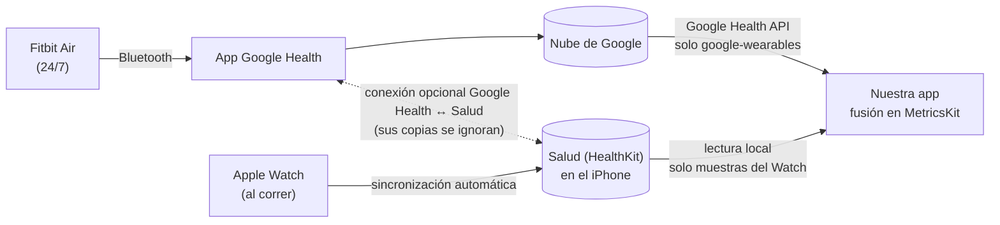

# 16 · Apple Watch y fusión de datos

Llevas la **Fitbit Air 24/7, también cuando corres**, y el **Apple Watch solo para correr**: cada carrera la graban los dos. Este documento explica cómo entra el Apple Watch en la app y cómo se combinan los datos de los dos dispositivos **sin contar nada dos veces**. Las reglas formales están en ALG-FUS ([doc. 05 §0 bis](05-algoritmos-y-metricas.md#0-bis-fusión-de-fuentes-alg-fus)) y los requisitos en RF-CON-06/09, RF-SYN-09..11, RF-FUS y RF-ENT-08 ([doc. 04](04-requisitos-funcionales.md)). Información verificada a 29/09/2026; lo marcado **[verificar]** se comprueba en el *spike* de F0.

## 0. En resumen

- El Apple Watch se lee **directamente de Salud (Apple Health, HealthKit) en el iPhone**: en local, sin red, al momento y con todo el detalle (ruta GPS, ritmo, dinámica de carrera, FC de alta frecuencia, VO₂ máx., FC de recuperación). **Solo lectura**: la app nunca escribe en Salud.
- La Fitbit Air se sigue leyendo de la **Google Health API**, pero solo los datos grabados por pulseras de Google (`google-wearables`), para que no vuelvan por Google las carreras del Watch.
- De Salud solo se aceptan muestras **grabadas por el Apple Watch**; lo que escriba allí la app Google Health se ignora.
- Un motor de **fusión** (en `MetricsKit`, puro y con tests) decide qué fuente manda en cada dato y minuto: el Watch en sus entrenamientos y la Fitbit Air el resto del día y toda la noche.
- **Cada vez que abres la app se sincronizan las dos fuentes**. Además, cuando el Watch pasa una carrera al iPhone, iOS puede despertar la app para importarla y avisarte.
- Como corres con los dos puestos, **cada carrera llega por las dos vías**: la unión de actividades (ALG-FUS-02) y la elección del pulso (ALG-FUS-03) se aplican siempre, la distancia del día usa el GPS del Watch en tus carreras y puedes comparar el pulso de ambos (RF-FUS-10).
- Sin Apple Watch la app funciona exactamente igual que antes.

## 1. Qué aporta cada dispositivo

| Dato | Fitbit Air (Google Health API) | Apple Watch (Salud) | Manda |
|---|---|---|---|
| Sueño, fases y siestas | Sí (la llevas de noche) | Solo si durmieras con él | **Fitbit Air** |
| VFC nocturna | RMSSD de la noche | SDNN puntual (otra medida, no comparable) | **Fitbit Air** |
| FC en reposo, SpO₂, FR, temperatura | Sí | Parcial | **Fitbit Air** |
| FC durante el día | Continua | Solo mientras lo llevas | **Fitbit Air** |
| FC durante la carrera | Sí | Alta frecuencia en entrenamientos | **Apple Watch** (configurable) |
| Entrenamiento: tipo, inicio y fin | Detección automática (a partir de 10–20 min) | Lo inicias y lo paras tú | **Apple Watch** (se fusionan) |
| Ruta, distancia, ritmo, parciales, desnivel | Sin GPS propio | GPS del reloj | **Apple Watch** |
| Dinámica de carrera (potencia, zancada, oscilación vertical, contacto con el suelo) | No | Sí | **Apple Watch** |
| FC de recuperación a 1 min y esfuerzo | No | Sí | **Apple Watch** |
| VO₂ máx. | Carreras con el GPS del móvil | Carreras y caminatas al aire libre | Una serie por fuente; principal, la del **Watch** |
| Pasos, distancia y calorías del día | Todo el día | Solo mientras lo llevas | **Fitbit Air**; en tus carreras, la distancia del GPS del **Watch** (y todo del Watch si no llevabas la pulsera) |

La «Carga de entrenamiento» de watchOS no está disponible en HealthKit; nuestra Carga (ALG-CAR) cumple esa función con los datos de los dos.

## 2. Cómo llegan los datos

La app Google Health puede conectarse con Salud **en los dos sentidos**: lee de Salud ejercicio, rutas, FC, VFC, pasos, VO₂ máx., sueño… y escribe en Salud casi lo mismo (salvo VFC y temperatura cutánea) ([ayuda de Google](https://support.google.com/googlehealth/answer/17037331)). Si la tienes activada, sin precauciones tus carreras del Watch llegarían también por Google y los datos de la Fitbit también por Salud. Las reglas del §5 lo evitan; **no hace falta desconectar nada**.

## 3. Qué se lee de Salud (solo lectura)

| Tipo de HealthKit | Disponible desde | Uso |
|---|---|---|
| Entrenamientos (`HKWorkout`) y sus rutas (`HKWorkoutRoute`, `HKSeriesType.workoutRoute()`) | iOS 8 (rutas: iOS 11) | Actividades, mapa y parciales |
| `heartRate` | iOS 8 | FC del entrenamiento y relleno de huecos (ALG-FUS-03) |
| `distanceWalkingRunning`, `activeEnergyBurned`, `stepCount` | iOS 8 | Distancia y energía del entrenamiento; huecos de la pulsera (ALG-FUS-04) |
| `runningSpeed`, `runningPower`, `runningStrideLength`, `runningVerticalOscillation`, `runningGroundContactTime` | iOS 16 | Dinámica de carrera (RF-ENT-08) |
| `heartRateRecoveryOneMinute` | iOS 16 | FC de recuperación tras la carrera |
| `vo2Max` | iOS 11 | VO₂ máx. del Watch (ALG-FUS-06) |
| `workoutEffortScore`, `estimatedWorkoutEffortScore` | iOS 18 | Esfuerzo de Apple junto a tu RPE |

**No se piden** (minimización, RNF-PRI-01) la VFC del Watch (`heartRateVariabilitySDNN`: HealthKit mide la VFC como SDNN), su FC en reposo ni su sueño, porque no se usan (ALG-FUS-05).

Fuente: documentación de HealthKit de Apple (identificadores de `HKQuantityTypeIdentifier`, consultada el 29/09/2026).

## 4. Permisos, origen de los datos y privacidad

| Aspecto | Requisito |
|---|---|
| Capacidad | HealthKit (`com.apple.developer.healthkit`) en el App ID y en `project.yml`; sin «Clinical Health Records» |
| Texto del permiso | `NSHealthShareUsageDescription`: «Recupera lee de Salud los entrenamientos, rutas, frecuencia cardiaca, métricas de carrera y VO₂máx de tu Apple Watch para fusionarlos con los datos de tu Fitbit Air…». La app nunca pide permiso de escritura (así no hay bucles); aun así `Info.plist` lleva `NSHealthUpdateUsageDescription` («Recupera no escribe nada en Salud…») porque la validación de App Store Connect puede exigirlo a cualquier app con HealthKit |
| Segundo plano | *Entitlement* `com.apple.developer.healthkit.background-delivery` (obligatorio desde iOS 15 para la entrega en segundo plano) |
| Permiso denegado | iOS no dice a la app si denegaste la lectura (`authorizationStatus` solo informa de la escritura). Si no llegan entrenamientos, la app lo explica y guía a Salud › Compartir › Apps (RF-CON-09). Desde iOS 27 puedes dar acceso solo a los datos recientes; con `earliestAuthorizedSampleDate(for:)` la app podrá mostrar desde qué fecha ve tu historial (pendiente: la v0.1 se compila con el SDK de iOS 26) |
| Origen de cada muestra | `sourceRevision` indica la app que la guardó (`source.bundleIdentifier`) y el dispositivo (`productType`, p. ej. `Watch…`). Solo se aceptan muestras **grabadas en un Apple Watch** (`productType` que empieza por `Watch`), con cualquier app del reloj (Entreno, Strava…), salvo las que escriben apps de Google (`bundleIdentifier` que empieza por `com.google`); así se descartan las que Google Health copia a Salud y las de apps del iPhone. Los campos de `HKDevice` los rellena quien escribe, así que no bastan por sí solos. Implementado en `Fusion.acceptsHealthKitSample`; valores exactos [verificar] con tus datos |
| Ubicación | La ruta es un dato de ubicación: se queda en el iPhone (solo sale si exportas) y el Coach recibe resúmenes, nunca coordenadas |
| Condiciones de Apple | Uso solo para funciones de salud y forma física visibles en la app, sin publicidad ni cesión a anunciantes o intermediarios, y solo con el uso que consientas (RL-80 a RL-82) |

## 5. Reglas de fusión: quién manda en cada dato

Resumen de ALG-FUS (doc. 05):

1. **Una sola fuente por dato y minuto; nunca se promedian** (ALG-FUS-01).
2. **Actividades** (ALG-FUS-02): una sesión de la Fitbit y un entrenamiento del Watch son la misma actividad si se solapan al menos la mitad de la más corta. Resultado: una actividad con los datos del Watch y la Fitbit como fuente secundaria.
3. **FC por minuto** (ALG-FUS-03): en entrenamientos del Watch, el Watch (si tiene ≥ 2 muestras válidas ese minuto); fuera, la Fitbit; los huecos de una los rellena la otra. Si difieren > 15 lpm durante ≥ 5 min, se avisa.
4. **Pasos, distancia y calorías** (ALG-FUS-04): pasos y calorías de la Fitbit; la distancia también, salvo en tus carreras con GPS, donde manda el Watch; si no llevabas la pulsera, el Watch rellena esos minutos.
5. **Noche y líneas base** (ALG-FUS-05): solo la Fitbit.
6. **Concordancia** (ALG-FUS-10): en cada carrera se mide cuánto se parecen el pulso del Watch y el de la Fitbit.
7. **Sin copias cruzadas** (ALG-FUS-08): de Google solo se lee la familia `google-wearables`, que según la API contiene «datos grabados por pulseras y relojes de Google y Fitbit» y excluye lo registrado a mano y lo estimado por el móvil. Que también excluya lo importado de Salud se deduce de esa definición [verificar]. Si algún tipo se lee con `list` (sin familia de fuentes), la app descarta los puntos con `dataSource.platform = HEALTH_KIT`. De Salud, solo lo grabado por el Watch.

Ejemplo: sales a correr de 18:00 a 18:45 con los dos; la Fitbit detecta «Correr» de 18:02 a 18:44 y «Caminar» de 18:44 a 19:05 (vuelves andando).

| Qué registran | Qué ves |
|---|---|
| Watch 18:00–18:45 «Carrera» + Fitbit 18:02–18:44 «Correr» | **Una** carrera de 18:00 a 18:45 con ruta, ritmo y FC del Watch (insignia ⌚+◉) |
| Fitbit 18:44–19:05 «Caminar» (21 min, 20 fuera del Watch) | Una caminata aparte, con la FC de la Fitbit |
| FC de 18:00 a 18:45 | Del Watch; el resto del día, de la Fitbit |
| Pasos y calorías del día | Los de la Fitbit (llevabas la pulsera) |
| Distancia del día | La de la Fitbit, con los 45 min de carrera sustituidos por los km del GPS del Watch |
| Pulso de la carrera en los dos | Curvas superpuestas y, p. ej., «el Watch marca de media 2 lpm más» (ALG-FUS-10) |

Consecuencia de usar `google-wearables`: una actividad que registres **a mano** en la app Google Health no llega; regístrala en esta app (RF-ENT-04).

## 6. Sincronización

| Momento | Apple Health (Apple Watch) | Google Health (Fitbit Air) |
|---|---|---|
| **Al abrir la app o volver a ella** (RF-SYN-09) | Consulta incremental con **ancla** por tipo (`HKAnchoredObjectQuery`: nuevos y borrados desde la última vez), en local, ≤ 1 s | Últimas 48 h y huecos (doc. 10 §6), ≤ 3 s si los datos ya están en Google |
| **Al terminar una carrera** (RF-SYN-11) | Entrega en segundo plano (`HKObserverQuery` de entrenamientos + `enableBackgroundDelivery`): la app se despierta, importa, fusiona y avisa (NOT-12) | — |
| Mañana | — | `BGAppRefreshTask` de sueño y recuperación |
| Noche (cargando) | Revisión de 30 días: borrados que se hubieran perdido y rutas añadidas después | Revisión de 7 días |
| Primera conexión | 180 días de entrenamientos con sus muestras | 90 días (RF-SYN-01) |

Detalles que condicionan el diseño (documentación de HealthKit):

- **Orden al abrir**: primero Salud (local) y se pinta; Google en paralelo; al llegar, se rehace la fusión de las ventanas afectadas y la pantalla se actualiza con una animación suave. Google, como mucho una vez por minuto (RF-SYN-03); Salud, siempre (es barato).
- Las **anclas** se guardan en la BD (`hk_anchors`). Los avisos de borrado son temporales («el sistema puede eliminarlos en cualquier momento»), de ahí la revisión nocturna.
- Una **ruta** puede añadirse o sustituirse después de guardar el entrenamiento: también se sigue con una consulta con ancla.
- **iPhone bloqueado**: los datos de Salud están protegidos (`errorDatabaseInaccessible`) y una lectura en segundo plano puede fallar. Se reintenta al desbloquear o al abrir, sin mostrar errores.
- HealthKit **condensa las muestras de los entrenamientos de hace unos meses** y borra las originales: la app guarda su propia copia al importarlas (doc. 09), así que conviene conectarla pronto.
- Si la app no responde tres veces a la entrega en segundo plano, HealthKit deja de enviarla: los observadores se registran al arrancar (adaptador de `UIApplicationDelegate` en SwiftUI) y se completan siempre.
- En Salud, los pasos tienen entrega en segundo plano como mucho cada hora; para los entrenamientos no hay límite documentado.
- Con el **modo de bajo consumo** o la opción «menos lecturas de GPS y FC» del Watch hay menos muestras de FC: esos minutos no llegan a 2 muestras y manda la Fitbit (ALG-FUS-03).
- La Fitbit Air solo sube datos cuando sincroniza con la app Google Health; nuestra app no puede forzarlo. Si hace tiempo que no lo hace, se indica y se ofrece «Abrir Google Health» con el enlace universal documentado `https://www.fitbit.com/in-app/today`. Al abrirse, Google Health sincroniza la pulsera si está cerca (RF-SYN-10).

## 7. Qué verás en la app

Detalle en el [doc. 11](11-ux-y-pantallas.md): cabecera de «Hoy» con el estado de cada fuente, insignias ⌚/◉ en actividades y gráficos, **detalle de carrera** con mapa y parciales (RF-ENT-08), **Ajustes › Fuentes de datos** (RF-FUS-07), aviso «Carrera importada» (NOT-12), comparación del pulso de los dos en cada carrera (RF-FUS-10) y el **análisis del día** con los datos de los dos (RF-ANA-01).

## 8. Pruebas y validación

- **Escenarios sintéticos** (tests de `MetricsKit` en Linux): los dos a la vez con FC parecida (el caso habitual, porque corres con los dos); los dos con discrepancia; solo Fitbit; solo Watch (pulsera cargando); la Fitbit parte la carrera en dos; carrera más paseo de vuelta (ejemplo del §5); copia de la carrera llegada por Google; copia de la FC de la Fitbit en Salud; borrado en Salud; cambio de zona horaria; carrera en cinta sin ruta.
- **Invariantes**: ningún minuto aporta FC, pasos o carga de dos fuentes; repetir la sincronización no cambia nada; quitar el Watch reproduce exactamente el resultado solo con la Fitbit (doc. 13 §2).
- **HealthKit en CI de macOS**: tests de integración en el simulador escribiendo muestras de prueba en un almacén de pruebas [verificar que HealthKit funciona en el simulador del *runner*].
- **Con tus datos**: como corres con los dos, cada carrera sirve. Tras las 5 primeras, concordancia de la FC minuto a minuto (Bland-Altman, ALG-FUS-10) y comparación de la carga con una u otra fuente; decide el valor por defecto de `hr_workout_priority` (doc. 13 §6).

## 9. Preguntas para el *spike* de F0

1. ¿`google-wearables` excluye de verdad las carreras del Watch que Google Health importa de Salud? (Se espera que sí.)
2. ¿La Fitbit Air detecta todas tus carreras? ¿Con qué desfase de inicio y fin respecto al Watch?
3. Frecuencia real de la FC del Watch durante tus carreras.
4. Valores de `sourceRevision` (`bundleIdentifier`, `productType`) de tus carreras y de lo que escribe Google Health en Salud.
5. Retraso de la entrega en segundo plano desde que terminas una carrera.
6. ¿Las sesiones `exercise` de la Fitbit se leen bien con `reconcile` y `google-wearables`, o hace falta `list` con el filtro por `platform`?
